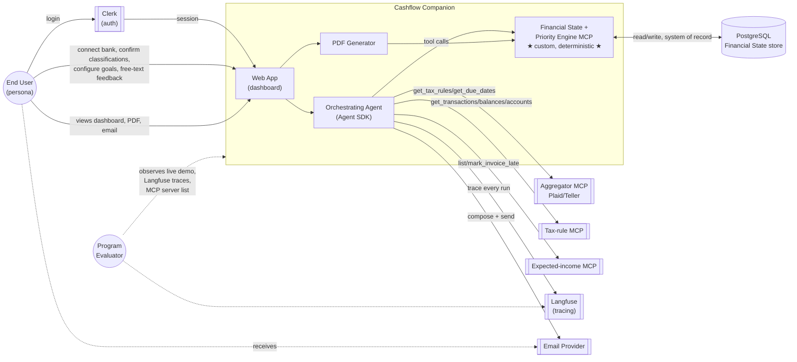
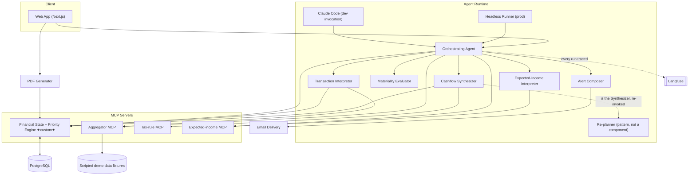
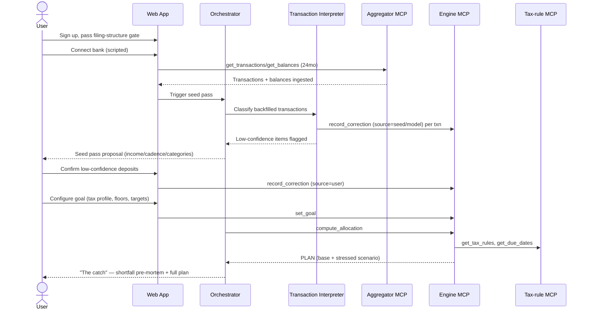
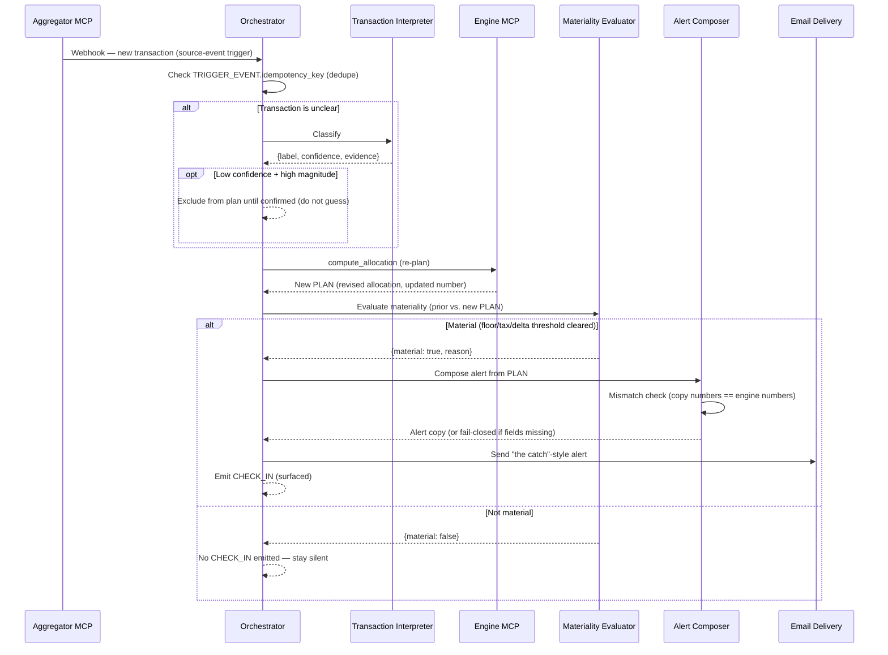
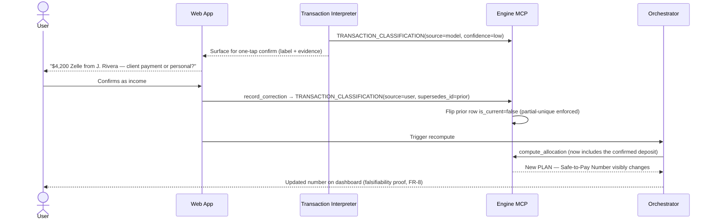

# Cashflow Companion — Pass 2: Solution Definition & Architecture

*Solution architecture pass · analysis-only narrative + architecture, no epics/stories/code ·
generated 2026-07-16*

**Scope of this pass:** Pass 1 (`docs/analysis/pass-1-document-analysis.md`) plus every source
document it analyzed — `README.md`, `docs/onepager.md`, `docs/PRD-v2.md`, `docs/personas.md`,
`docs/hypotheses.md`, `docs/ai-agents.md`, `docs/data-model.md` — re-verified directly against
those documents and against `git log --all` / `git status` / `git diff` (not taken on faith from
Pass 1). No epics, user stories, sprint tasks, or application code are produced here. Where the
ERD or docs have a gap, this pass documents a **recommendation**, not an edit — no source file is
modified.

**Labels used throughout**, per the working rules: **[Confirmed requirement]** (verbatim/near-
verbatim in a source), **[Architecture decision]** (this pass's own decision, with alternatives),
**[Assumption]** (judgment call where sources are silent), **[Recommendation]** (advice, not a
requirement), **[Deferred requirement]** (real, sourced, but out of Track A scope), **[Open
decision]** (still unresolved — needs a stakeholder answer before Pass 3 can safely proceed on
that item).

---

## 1. Executive summary

Cashflow Companion's Pass 1 analysis is directionally sound — the FR catalog, ERD read, and gap
list all check out against the primary sources — but its **headline counts contain arithmetic
errors** and, more importantly, **it does not separate "blocking for Demo Day" from "blocking
before real users."** Correcting both is the main work product of this pass's §2 (correction log)
and it changes the shape of Pass 3 in one important way:

> **Zero of Pass 1's "blocking" gaps actually block the scripted Demo Day build.** Every gap Pass 1
> marked blocking (GAP-001, GAP-002, GAP-003, GAP-005, GAP-011) is a gate on the **business
> thesis** (P1–P3/A1 validation), **real users** (counsel review, tax-math validation, retention),
> or the **real-data proof track** (multi-state tax-rule seeding) — not on the scripted,
> single-persona, single-state canonical demo `docs/PRD-v2.md` §7 actually requires.

This is not a reason to relax rigor — it is the reason Pass 2 defines three explicit delivery
tracks (§3) so that Track C (real-user readiness) requirements never silently inflate Track A
(scripted Demo Day) scope, per the working rule.

Architecturally, the existing documentation set gives Pass 2 an unusually strong foundation to
build on: one orchestrating agent + one deterministic engine (`docs/ai-agents.md`), a fully
versioned/lineage-tracked ERD (`docs/data-model.md`), and FR-1…FR-30 each mapped to a named
component and an eval case (`docs/PRD-v2.md` §11, §17). Pass 2's job is therefore **not** to
redesign this — the working rule against unnecessary ERD redesign is easy to honor — but to make
explicit the things the docs leave implicit: system context, component contracts, workflow
sequencing, the correction-log resolution, and a traceability matrix that proves every FR reaches
an architecture component, a workflow, and a test.

**Architecture decisions made in this pass** (full ADRs in §16): the correction log is
represented as documented, with a schema **clarification**, not a new entity (§6); Demo Day is
single-account, single-bank-connection scope even though the schema supports more (§16 ADR-007);
dev (Claude Code) and prod (headless runner) share the engine code path but never share a
database (§12); the aggregator MCP interface is provider-agnostic per `docs/PRD-v2.md` §9 with
Plaid/Teller as pluggable implementations, deferred to a stakeholder decision for the real-data
track (§16 ADR-008).

**Readiness for Pass 3:** **4/5** — architecturally ready to seed a Demo Day backlog today. The
remaining blockers are the same handful of open decisions Pass 1 surfaced (tax-rule state list,
aggregator vendor, email vendor) plus one this pass adds (the correction-log documentation
clarification, §6) — none of which require new design work, only stakeholder answers or a doc
edit. See §19 for the full breakdown.

---

## 2. Pass 1 correction log

Every row below was checked against the cited primary source, not against Pass 1's paraphrase of
it.

| # | Pass 1 finding | Correction | Reason | Source evidence | Impact on Pass 2 |
|---|---|---|---|---|---|
| CL-01 | Executive summary: **"6 blocking gaps (of 19 total gaps identified)"** | **5**, not 6. The listed IDs are GAP-001, GAP-002, GAP-003, GAP-005, GAP-011 — five unique gaps. Pass 1's own sentence lists these five and then appends "...and GAP-005's schedule slip makes it effectively already-due" as if that were a sixth item; it is a restatement of GAP-005, not a new gap. | Simple counting error in Pass 1 §8 (Contradiction log) / §9 summary line. | `docs/analysis/pass-1-document-analysis.md` §9 summary paragraph, cross-checked against its own §9 table's "Blocking?" column | Corrected count carried into §3 below; more importantly, reclassified by track (see CL-02). |
| CL-02 | Gaps GAP-001, GAP-002, GAP-003, GAP-005, GAP-011 labeled **"Blocking"** without a track qualifier in the executive summary (though the detailed table for GAP-002/003/011 does say "before real users") | **None of the five block Track A (scripted Demo Day).** GAP-002 (counsel review), GAP-003 (tax-math validation), GAP-011 (retention/deletion) are gates before **real users** (Track C). GAP-001 (P1–P3/A1 validation) gates the **business thesis**, not the build — `hypotheses.md` frames it as a parallel validation track, and `PRD-v2.md` §21's milestones proceed without it. GAP-005 (tax-rule state seed) only needs **federal + CA** for the canonical scenario (Dev is CA-based, `PRD-v2.md` §7) — additional states are a Track B/C concern. | The task's own working rule: distinguish gaps blocking Demo Day from gaps blocking real users. Pass 1's per-gap table already hedges this correctly for GAP-002/003/011; the executive summary flattens the hedge away. | `docs/PRD-v2.md` §7 (canonical persona is CA), §21 (milestones proceed without P1–P3/A1), §15 ("counsel review... before the tax engine is trusted for real users") | This is the single most consequential correction — it justifies the three-track model in §3 and means Track A's entry/exit criteria (§3) carry **zero** inherited blockers from Pass 1's gap list. |
| CL-03 | Executive summary: **"3 high-severity contradictions/gaps"** | **5**, not 3: contradiction C-003 (High) + gaps GAP-002, GAP-003, GAP-005, GAP-011 (all High in Pass 1's own §9 table). | Second counting error — the headline undercounts against Pass 1's own detailed severity column. | `docs/analysis/pass-1-document-analysis.md` §8 (C-003 = High) and §9 (four gaps tagged High) | No architectural impact; corrected here for traceability integrity, since Pass 3 backlog prioritization may cite this number. |
| CL-04 | GAP-005 framed as a straightforward build blocker ("already past its own milestone date") | Confirmed the schedule observation is accurate (W2 = Jun 30–Jul 6; today, 2026-07-16, is in W4), but the **scope** is overstated: Track A only requires the tax-rule MCP seeded for **federal + CA**, which the canonical scenario already assumes exists (§7's tax figures presuppose CA rates). The open question is which *additional* 1–2 states to add — that decision is not on Track A's critical path. | `PRD-v2.md` §7 locks the demo to a CA persona; §23's open question is about states *beyond* the demo's own requirement. | `docs/PRD-v2.md` §7, §23 | Reclassified as a Track B/C open decision (§3, §19), not a Track A blocker. |
| CL-05 | C-004 (correction-log naming vs. ERD) — flagged Medium severity, unresolved | **Confirmed accurate**, no correction. This pass resolves it in §6 (documentation clarification, not a schema change). | Re-verified: `data-model.md`'s ERD genuinely has no `CORRECTION` entity; `PRD-v2.md` §12 and `ai-agents.md` (Components 1, 2, 8) genuinely name "the correction log" as a first-class concept. | `docs/data-model.md` full ERD (no `CORRECTION` table); `docs/PRD-v2.md` §12; `docs/ai-agents.md` Components 1, 2, 8 | Carried forward and closed in §6; ADR-006 in §16. |
| CL-06 | C-001 ("v3 Brief" vs. one-pager labeled "v2") | Confirmed accurate — `PRD-v2.md` line 6 literally reads "**v3 Brief** · One-pager · Personas · Hypotheses · AI Agent design," and `onepager.md` line 3 is headed "v2." | Re-verified by direct read; not a Pass 1 error. | `docs/PRD-v2.md` line 6; `docs/onepager.md` line 3 | Carried forward as OPEN-DOC-01 (documentation-only fix, §18); no architecture impact. |
| CL-07 | C-002 (PRD v1.0 missing from repo/git history) | Confirmed accurate via `git log --all --oneline`: the earliest commits are `11baaf5` (Initial commit), then docs were added one at a time (`53ffcd7` personas, `b1d56b5` onepager, `41e4181` hypotheses, `b36c290` PRD-v2, `8ee7e2a` ai-agents). No PRD v1 file was ever committed. | Re-verified directly against `git log --all`, not inferred. | `git log --all --oneline` output (this pass) | No change; strengthens confidence in AS-002/AS-004 from Pass 1. |
| CL-08 | AS-001 ("`data-model.md`... intended as authoritative, not a draft") | Confirmed still accurate — `git status` shows `docs/data-model.md` untracked and `README.md`'s single uncommitted change is the one line adding the Data Model doc-table row. Nothing has changed since Pass 1. | Re-verified via `git status`/`git diff` (this pass). | `git status --porcelain`, `git diff -- README.md` (this pass) | No change. |
| CL-09 | Requirement catalog (§4, all subsections) — FR/BR/UX/BRULE/DR/INT/SEC/PRIV/COMP/AUD/OPS/ONB/NFR IDs and their source citations | Confirmed accurate on spot-check of every FR (FR-1…FR-30 against `PRD-v2.md` §11), BRULE-006's clamp formula (verified arithmetically: `11,900+2,800−4,150−900−6,000=3,650`), and DR-001's entity list (verbatim match to `PRD-v2.md` §12). No corrections needed. | Full re-derivation of the headline arithmetic and spot-checks of ~15 other IDs against source text. | `docs/PRD-v2.md` §7, §11, §12 | This pass's traceability matrix (§17) reuses these IDs as-is; FR-1…FR-30 confirmed present and correctly stated, satisfying this pass's own completeness check. |
| CL-10 | §5 persona coverage table (no support/compliance/admin/risk personas documented) | Confirmed accurate. | Re-verified against `personas.md` in full — no internal-role persona appears anywhere in the document. | `docs/personas.md` (full document) | Carried forward into §5 (system context) as an explicit **[Assumption]** that Track A needs no internal-actor UI, only external end-user + program-evaluator actors. |

**Net effect of this correction log on Pass 2 scope:** the three-track model in §3 is the direct
consequence of CL-02/CL-04 — it exists specifically so that Track C requirements (legal, tax
validation, retention, security program) never get silently absorbed into what Track A actually
needs to build.

---

## 3. Delivery tracks and decision gates

### Track A — Scripted Demo Day (target: 2026-08-14)

**Objective.** Satisfy all seven acceptance bars (`PRD-v2.md` §8) live, on stage, using scripted/
sandbox data, with proof artifacts for each bar.

**Included capabilities [Confirmed requirement, PRD-v2.md §6, §8, §11]:**
- Bank connect + 24-month backfill on **scripted/sandbox data only** (FR-1, FR-27)
- Transaction Interpreter: deposit/outflow classification + confidence + evidence + one-tap
  confirm (FR-5…FR-8)
- Cashflow Synthesizer: deterministic allocation, tax set-aside, Safe-to-Pay Number (FR-9…FR-14)
- Re-planner across all 3 trigger types: schedule, source-event, manual-feedback (FR-15…FR-21)
- 3 outputs: dashboard, PDF, email (FR-22…FR-24)
- Safety floors (FR-25, FR-26)
- 4 MCP sources incl. 1 custom-authored (Bar 3)
- Clerk auth + live HTTPS deploy + cost cap (Bar 6)
- Langfuse trace of the full loop + spend ceiling (Bar 7)
- 3 scripted personas — Maya (normal), Dev (the catch, canonical), Sam (windfall) — each with
  24 months of scripted transactions (`PRD-v2.md` §18)

**Excluded from Track A [Confirmed requirement, PRD-v2.md §6 "Non-goals"]:**
- Any live/real bank OAuth connection or real PII (§16 of this doc)
- Money movement of any kind
- Live invoicing integration (Stripe/QBO)
- S-corp support
- Multi-state tax matrix beyond the seeded set
- Learned/ML spend prediction
- SOC 2 or a production security program
- Support/ops tooling, consent management, retention/deletion tooling (all Track C)

**Entry criteria:** canonical scenario fixtures locked (`PRD-v2.md` §7 — already true as of this
doc); custom Financial State + Priority Engine skeleton exists; W1 milestone complete.

**Exit criteria:** all 7 acceptance bars demonstrated live with proof artifacts; 14/14 core evals
green (+6 if Materiality Evaluator / Alert Composer are built); canonical scenario reproduces
$3,650 on stage; an interpreter-confirm visibly moves the number (`PRD-v2.md` §17).

**Dependencies:** program-provided infra (Clerk, Langfuse, deploy target) — `PRD-v2.md` §20, R-008.

**Risks:** R-001 (wrong number on stage — mitigated by the locked canonical scenario), R-005/R-006
(classifier accuracy — mitigated because Track A only needs the classifier to work on the
*scripted* eval set, not real data; the harder accuracy question is explicitly Track B/C).

**Required evidence:** the 7 proof artifacts named per-bar in `PRD-v2.md` §8's table; the 14(+6)
green eval suites; a Langfuse trace ID for the demoed re-plan loop.

### Track B — Real-data proof (optional, non-blocking)

**Objective [Confirmed requirement, PRD-v2.md §9 "Demo runs on scripted/sandbox data; a real-data
proof is a parallel, non-blocking track"]:** prove the aggregator abstraction and the Transaction
Interpreter work against **non-scripted** data, without claiming production readiness.

**Included:** a real Plaid or Teller sandbox/limited-production connection behind the same
`get_transactions`/`get_balances`/`get_accounts` MCP interface used in Track A (INT-001); running
the Transaction Interpreter against real, messy, commingled transaction data; A1 (classifier
accuracy on real anonymized statements — `hypotheses.md` A1, which explicitly "needs no live
users").

**Excluded:** any behavior change users would perceive as production-grade (no support channel,
no retention policy, no consent flow — those are Track C).

**Entry criteria:** Track A's aggregator-agnostic MCP interface exists and is stable; an
aggregator vendor decision is made (OPEN-ENG-01, §19).

**Exit criteria:** A1's success threshold is measured against real anonymized commingled
statements (`hypotheses.md`: a defined precision/recall bar, not yet numerically fixed — see
OPEN-ENG-02); the aggregator abstraction proves it can swap providers without touching the
Synthesizer/Interpreter code.

**Dependencies:** OPEN-ENG-01 (Plaid vs. Teller), a real anonymized commingled-statement dataset
(sourcing is unaddressed in any doc — new gap, see §19).

**Risks:** R-006 (classifier accuracy unproven on real data) is Track B's entire reason to exist;
a failing A1 result does not block Track A (already demoed on scripted data) but should block
promotion to Track C.

**Required evidence:** A1 test results (precision/recall against the pre-committed threshold);
confirmation the same MCP tool signatures serve both scripted and live data.

### Track C — Real-user readiness (deferred, explicitly gated)

**Objective:** everything that must be true before **any real, non-scripted user** relies on the
Safe-to-Pay Number for money they actually manage.

**Included [Confirmed requirement, multiple sources]:**
- Legal/compliance: counsel review of the NFA disclaimer (COMP-002, `PRD-v2.md` §15,
  `onepager.md`) — **[Deferred requirement]**
- Tax-math validation against real filed Schedule C returns (COMP-004, `PRD-v2.md` §19) —
  **[Deferred requirement]**
- Classifier precision/recall validated as safe to automate for real users (COMP-005, `PRD-v2.md`
  §19) — builds on Track B's A1 result but requires a live-user-safety bar, not just a research
  result — **[Deferred requirement]**
- P1–P3 business-validation interviews (`hypotheses.md` — existential to the *business*, not the
  build) — **[Deferred requirement]**
- Data retention/deletion policy (GAP-011) — **[Deferred requirement]**
- Consent/notification-preference model (GAP-007) — **[Deferred requirement]**
- A defined security posture beyond demo-grade (SEC-004 names demo-grade as an explicit
  *non-goal* for production — R-002) — **[Deferred requirement]**
- A support/ops model and persona (GAP-013, absent from all docs) — **[Deferred requirement]**
- Token storage hardening beyond "encrypted at rest" — KMS/secrets-manager specifics (P1 stakeholder
  question #13) — **[Open decision]**

**Excluded:** nothing is excluded in principle; this track is a checklist, not a scope boundary —
its entry criterion is simply "Track A or B is complete and a decision has been made to pursue
real users."

**Entry criteria:** an explicit business decision to pursue real users (not made in any source
document as of this analysis).

**Exit criteria:** every item above resolved with a named owner and a completion date — currently
**none have both** (Pass 1 GAP-002/GAP-003/GAP-011, confirmed still true).

**Dependencies:** all of Track A (proves the loop works) and ideally Track B (proves it works on
real data) precede Track C.

**Risks:** R-001, R-003, R-009 (legal exposure, privacy exposure, tax-accuracy exposure) — all
correctly flagged High in Pass 1 and unchanged by this pass.

**Required evidence:** signed-off counsel review artifact; a tax-validation report against a real
filed-return sample; a written retention/deletion policy; a named support-escalation path.

---

## 4. Confirmed scope and exclusions

This section exists so Pass 3 backlog authors have one place to check "is X in scope" without
re-reading the tracks table.

| Capability | Track A (Demo Day) | Track B (real-data) | Track C (real users) |
|---|---|---|---|
| Bank connect + backfill | Scripted only | Real Plaid/Teller | Same, hardened |
| Transaction classification | On scripted eval set | On real anonymized data (A1) | Validated safe (COMP-005) |
| Tax computation | Federal + CA, canonical scenario | Same | Validated vs. real returns (COMP-003) |
| Money movement | Never (read-only) | Never | Never in v1 (v3 roadmap only, `PRD-v2.md` §22) |
| Security posture | Demo-grade (SEC-004) | Demo-grade | Full program required (deferred, undefined) |
| Retention/deletion | Not needed (no real user data) | Not needed | **Required, undefined** — GAP-011 |
| Consent/notifications | Not needed | Not needed | **Required, undefined** — GAP-007 |
| Support/ops | Not needed | Not needed | **Required, undefined** — GAP-013 |
| Legal disclaimer review | Displayed, not counsel-reviewed | Same | **Required before trust** — COMP-002 |
| Multi-state tax | Not needed (CA-only) | Decision needed (OPEN-ENG-03) | Full matrix, undecided |

No production-readiness requirement from Track C is treated as in-scope for Track A anywhere in
this document — this is the direct application of CL-02.

---

## 5. System context

### Actors and systems

| Actor / system | Purpose | Inputs | Outputs | Trust level | Data handled | Auth mechanism | Failure impact | Demo (Track A) | Future production |
|---|---|---|---|---|---|---|---|---|---|
| **End user (primary/secondary persona)** [Confirmed, personas.md] | Owns the Safe-to-Pay decision; confirms classifications; configures goals | Bank connection consent, goal config, classification confirmations, free-text feedback | Views dashboard/PDF/email, acts (or not) on the number | Authenticated, self-scoped | Own financial data | Clerk session | No user = no demo | Scripted persona login via Clerk | Real Clerk account |
| **Program/Demo evaluator** [Recommendation — not named in sources but implied by PRD §8's rubric structure] | Scores the 7 acceptance bars | Live demo, MCP server list, Langfuse traces | Pass/fail per bar | Observer, no write access | None | Clerk (viewer) or none | A missed proof artifact fails a bar | Watches the golden-path script (`PRD-v2.md` §18) | N/A — Track A only |
| **Orchestrating Agent** [Confirmed, ai-agents.md Component 1] | Judgment layer; interprets triggers, routes to skills, selects the one decision | Trigger events, Financial State, NL messages | Structured state updates, at most one surfaced decision, narration | Trusted internal service, no direct financial write authority | Reads all Financial State; writes only via engine tool calls | Service-to-service (backend-internal) | A stuck/erroring run blocks re-planning | Claude Agent SDK, headless runner + Claude Code dev invocation | Same, hardened process isolation |
| **Financial State + Priority Engine (custom MCP)** [Confirmed, PRD-v2.md §9, §12] | Sole authority for financial arithmetic, allocation, floors, tax math | Goal config, classified transactions, expected income, tax rules, balances | `PLAN` + children (allocation, projections, warnings) | Highest trust — system of record | All financial state | Service-to-service | Wrong output = trust-ending | Custom-authored MCP server, Postgres-backed | Same; scaling/HA deferred (Track C) |
| **Aggregator MCP** [Confirmed, PRD-v2.md §9, §12] | Bank data source, provider-agnostic | `get_transactions`, `get_balances`, `get_accounts` calls | Transactions, balances, accounts | External, read-only scope | Bank transaction data (PII-adjacent) | OAuth token (Plaid/Teller), encrypted at rest (SEC-001) | Stale/broken feed flagged, not silently wrong (OPS-002) | Scripted/sandbox data source behind the same interface | Live Plaid/Teller behind unchanged interface |
| **Tax-rule MCP** [Confirmed] | Versioned, cited tax reference data | `get_tax_rules`, `get_due_dates` | Rate/bracket/due-date sets | Internal, seeded reference data | No PII — public tax reference | Service-to-service | Wrong/missing rule = wrong number | Seeded federal + CA, static | Same pattern, more states (Track B/C decision) |
| **Expected-income MCP** [Confirmed] | Manual invoice/expected-income tracking | `list_expected_income`, `mark_invoice_late` | Expected-income records | Internal, in-app | User-entered invoice metadata | Service-to-service | Missed status update = stale projection | In-app manual entry only | Same; email ingestion is a named fast-follow (ai-agents.md Component 7) |
| **Clerk (auth provider)** [Confirmed, PRD-v2.md §16] | Authentication/session gate | Login credentials | Session/identity | External IdP | Email/identity only | OAuth/session | No login = no access | Program-provided | Same |
| **Langfuse (observability)** [Confirmed, PRD-v2.md §16] | Traces every agentic loop | Trace/span events from the agent | Queryable trace | External, write-only from app | Trace payloads (may include txn evidence — see §11 redaction) | API key | No trace = Bar 7 evidence gap | Program-provided | Same, with stricter redaction |
| **Email provider** [Confirmed as a requirement; vendor is an Open decision, PRD-v2.md §23] | Delivers "the catch" alert | Alert Composer output | Sent email | External | Recipient email + alert content (numbers) | Vendor-specific | FR-24 fails to demo if broken | Vendor TBD (OPEN-ENG-04) | Same, plus deliverability/consent (Track C) |
| **PDF generator** [Confirmed, FR-23] | Renders the cashflow/tax plan on demand | Plan output | PDF file | Internal, no external trust boundary | Plan figures | N/A (internal call) | Bar 4 partially unmet if broken | Server-side render from Synthesizer output | Same |
| **Postgres (Financial State store)** [Confirmed, PRD-v2.md §9 "Stack assumptions"] | Persistent system of record | Writes from the engine | Reads for every component | Internal, highest sensitivity | All financial + PII-adjacent data | Network/credential-scoped | Data loss = total loss of state | Single demo database, reset between runs (§12) | Same, with backup/DR (Track C, NFR-deferred) |

### Mermaid system-context diagram



---

## 6. Logical architecture

### Component table

| Component | Responsibilities | Non-responsibilities | Inputs / Outputs | Authoritative data owned | Dependencies | Failure behavior | Idempotency | Security boundary | Observability | Demo implementation | Deferred concerns |
|---|---|---|---|---|---|---|---|---|---|---|---|
| **Web application** | Render dashboard, goal config UI, one-tap confirm UI, PDF download trigger | Never computes a financial figure client-side | In: user actions. Out: API calls to Agent/Engine | None (view layer) | Clerk, backend API | Show stale/error state, never fabricate a number | N/A (read-mostly) | Behind Clerk session | Frontend error logging (basic) | Next.js (PRD-v2.md §9 "Stack assumptions") | Accessibility depth (§11) |
| **Auth & session (Clerk)** | Authenticate, gate the app | Does not model financial permissions beyond "is this the account owner" | In: credentials. Out: session/identity | Identity only | External Clerk service | No session = no access, fails closed | Session tokens are inherently idempotent | Program-provided (Bar 6) | Login events | Clerk-gated (SEC-002) | Role-based access (Track C — no roles exist yet, §5) |
| **Orchestrating Agent** | Interpret triggers/messages, route to skills, select the one decision, narrate | Never computes/overrides a financial figure (§7) | In: `TRIGGER_EVENT` + Financial State. Out: state updates + ≤1 surfaced decision | None — stateless judgment layer (`ai-agents.md` Component 1: "does not hold financial truth in-context") | Engine, Aggregator, Tax-rule, Expected-income MCPs, all 6 skills | Ask a clarifying question rather than guess; never fabricate a state change | `TRIGGER_EVENT.idempotency_key` prevents duplicate runs from the same event (§9 data architecture) | Backend-internal, spend-capped (SEC-005) | Full Langfuse trace per run, incl. every tool call | Agent SDK, headless runner (prod) + Claude Code (dev), same skill code | Multi-agent scale-out (explicitly rejected, ADR-001) |
| **Transaction Interpreter (skill)** | Classify deposits/outflows with confidence + evidence | Never assigns a label without emitting confidence; never silently includes an unconfirmed high-magnitude deposit in a plan | In: `TRANSACTION` fields + correction-log history. Out: `{label, cadence?, confidence, evidence}` | Writes `TRANSACTION_CLASSIFICATION(source=model)` rows only — does not own the row once superseded by a user correction | `aggregator.*` (read), `engine.get_state` (correction-log read), `engine.record_correction` (write) | Ambiguous/low-confidence → escalate to user, never guess | Re-classifying the same transaction twice with the same evidence should be safe (append-only `supersedes_id` chain — §9) | Same as Agent | Confidence captured per call (AUD-001) | 5 eval cases (`PRD-v2.md` §17) | Document Intake (vision/OCR) — explicitly deferred, `ai-agents.md` Component 9 |
| **Cashflow Synthesizer (skill)** | Deterministic engine call + plain-language explanation | Never adjusts a figure to make the narration read better; never computes off unconfirmed high-magnitude items | In: classified income/expense, goal config, balances, tax rules. Out: `PLAN` + prose | None — "stateless beyond its inputs" (`ai-agents.md` Component 3) | Engine, Tax-rule MCP, Aggregator (balances) | Reports shortfall/infeasibility explicitly rather than silently funding out of order | Dual-invocation (Claude Code + headless runner) must produce identical output given identical `input_digest` (§9) | Same as Agent | `input_digest`/`output_digest` per run (AUD-002) | Deterministic engine call, thin AI narration layer | N/A — this is the load-bearing deterministic boundary; no deferral |
| **Materiality Evaluator (skill, build-if-time)** | Deterministic-first gate: is this change worth surfacing? | AI is a tiebreaker only when ≥2 deterministic-material changes compete — never the primary gate | In: prior vs. new plan. Out: `{material, reason, ranked_candidates[]}` | None | `engine.get_projections` | Default to silence unless a hard rule fires; floor breaches/tax shortfalls always material (never AI-gated) | Re-evaluating the same plan pair should return the same verdict | Same as Agent | Materiality reason logged per run | 3 light evals if built | Alert-fatigue modeling beyond a simple recent-cadence check (not designed) |
| **Alert Composer (skill, build-if-time)** | Turn engine output into one message | Never states a number not present in the engine's structured output | In: engine result + user context. Out: alert copy | None — stateless | None (pure narration) | Fail closed: missing required fields → send nothing (`ai-agents.md` Component 6) | Re-composing from the same plan should be safe to retry | Same as Agent | Mismatch-check result logged (§7) | 3 light evals if built | Multi-channel delivery beyond email/UI (not requested) |
| **Expected-Income Interpreter (skill)** | Parse free-text signal into structured expected-income update | Never mutates state on an ambiguous parse — asks instead | In: NL message. Out: `mark_invoice_late(id, +Nd)` proposal | None | `expected-income.*` | Ambiguous parse → clarifying question | Re-parsing identical text should propose the identical mutation | Same as Agent | Rides Orchestrator's trace | Manual/free-text path only for v1 | Email ingestion (named fast-follow, not v1) |
| **Financial State + Priority Engine (custom MCP)** | All arithmetic: allocation, floor enforcement, tax computation, balance reconciliation, projections | Has no LLM in it; never receives or emits an unstructured/narrative field as authoritative | In: `get_state`, `set_goal`, `classify_transaction`(write path), `record_correction`. Out: `compute_allocation`, `get_projections` results (`PLAN` + children) | **The single system of record** for `PLAN`, `ALLOCATION_LINE`, `PROJECTION`, `GOAL_CONFIG`, `TAX_PROFILE`, `TRANSACTION_CLASSIFICATION` | Postgres, Tax-rule MCP (referenced at compute time) | Infeasible month → report shortfall via `plan_status=infeasible` / `PLAN_WARNING`, never silently under-fund taxes (FR-25/26) | `PLAN` recomputation with the same pinned input versions must be bit-for-bit reproducible (this is the entire point of `input_digest`) | Highest-trust internal service | `input_digest`/`output_digest`, full `PLAN_INPUT_*` lineage | Custom-authored MCP, Postgres-backed | Horizontal scaling / multi-tenant performance (Track C NFR, deferred) |
| **Aggregator MCP** | Provider-agnostic bank data | Never itself classifies a transaction (that's the Interpreter's job) | In: provider API. Out: `get_transactions`/`get_balances`/`get_accounts` | `TRANSACTION`, `ACCOUNT_BALANCE_SNAPSHOT`, `BANK_ACCOUNT`, `BANK_CONNECTION` (immutable ground truth) | Provider SDK (Plaid/Teller) or scripted-data fixture loader | `BANK_CONNECTION.status=stale|error` flagged, not hidden (OPS-002) | Sync operations keyed by `provider_txn_id`/`sync_id` to avoid duplicate ingestion | External network boundary; token encrypted at rest (SEC-001) | Sync status/timestamps | Scripted-data fixture loader implementing the same interface | Live OAuth flow (Track B) |
| **Tax-rule MCP** | Seeded, versioned, cited tax reference | Never estimates a rate — only serves seeded, checksummed reference data | In: `(filing_status, state, year)`. Out: rate/bracket/due-date sets | `TAX_RULE_SET`, `TAX_BRACKET`, `TAX_DUE_DATE` | None (static seed) | Missing rule set for a requested jurisdiction → engine reports "cannot compute," never guesses | Read-only; naturally idempotent | Internal | `TAX_RULE_SET.checksum`/`citation` for auditability | Seeded fixture for federal + CA | Additional states (OPEN-ENG-03) |
| **Expected-income MCP** | Manual invoice tracking | No live invoicing integration (Stripe/QBO) — explicit non-goal | In: manual entries. Out: expected-income records | `EXPECTED_INCOME`, `EXPECTED_INCOME_VERSION` | None | Missing update → projection flagged stale, not wrong | `invoice_ref` as natural key prevents duplicate entries | Internal, in-app | State transitions logged via versioning | In-app manual entry | Live invoicing (Track C+ roadmap, `PRD-v2.md` §22 v2) |
| **PostgreSQL persistence** | Durable system of record; append-only versioning | Not a cache — no TTL/eviction logic | In: writes from Engine. Out: reads for all components | All entities in `data-model.md`'s ERD | None | Connection failure → Engine reports "state unavailable," agent does not proceed | Schema enforces `is_current` partial-uniqueness (natural idempotency for versioned writes) | Network-isolated, credential-scoped | Query/connection metrics (basic) | Single demo instance, reset script (§12) | Backup/DR, read replicas (Track C) |
| **PDF generation** | Render plan output as a downloadable document | Not a data source — reads only already-computed `PLAN` output | In: `PLAN` + children. Out: PDF file | None | Synthesizer output | Render failure surfaces an error, not a stale/wrong PDF | Re-rendering the same `PLAN.id` is naturally idempotent | Internal | Render success/failure logged | Server-side render (library TBD — not specified in sources) | Styling polish (named cuttable, `PRD-v2.md` §21 "cut in this order") |
| **Email delivery** | Send "the catch" alert | Never sends copy the mismatch check has rejected (§7) | In: Alert Composer copy. Out: sent email | None | Vendor TBD (OPEN-ENG-04) | Send failure logged, does not block UI/dashboard availability | Should dedupe on `CHECK_IN.id` to avoid double-send on retry (not explicitly specified — **[Recommendation]**) | External vendor boundary | Delivery status if vendor supports it | Vendor TBD | Consent/opt-in (GAP-007, Track C) |
| **Langfuse tracing** | Full trace of every agentic loop | Not a system of record for financial state — traces are evidence, not truth | In: spans from the Agent SDK. Out: queryable trace UI | None (external) | Program-provided | Missing trace = a Bar 7 evidence gap, not a functional failure | Traces are append-only by nature | External, write-mostly from app | This *is* the observability layer (§14) | Program-provided integration | Redaction policy for txn evidence in trace payloads (§11 — currently unspecified, **[Open decision]**) |
| **Headless production-style runner** | Executes the Agent SDK loop outside Claude Code, for Bar 5's dual-invocation and Bar 2's background triggers | Not a development tool — must not share a database with Claude Code dev invocations (§12) | In: trigger events (cron/webhook/manual). Out: same as Agent | None | Agent SDK, all MCPs, Postgres (demo DB) | Crash → `AGENT_RUN.status=error`, `AGENT_RUN_ATTEMPT` records the retry (AUD-003) | `TRIGGER_EVENT.idempotency_key` is the idempotency boundary for the whole loop | Deployed, Clerk-gated environment | Full trace per invocation | Deployed per Bar 6 | Multi-instance/HA runner (Track C) |
| **Scripted demo-data source** | Deterministic, reproducible transaction/balance fixtures for 3 personas | Not a real aggregator — never claims to be | In: none (static fixture set). Out: served through the same Aggregator MCP interface | Fixture data only | None | N/A — fixtures are static and version-controlled | Naturally idempotent (static data) | Internal only | N/A | 3 personas × 24 months, `PRD-v2.md` §18 | Real-data equivalent is Track B |

### Mermaid logical-component diagram



---

## 7. Computation and authority boundaries

This section makes the PRD's §10 table (already excellent) explicit and operational.

| Question | Answer | Source |
|---|---|---|
| Which operations may use an LLM? | Classifying ambiguous transactions (Transaction Interpreter); parsing free-text into structured state (Orchestrator, Expected-Income Interpreter); ranking which of several *already-material* changes to surface (Materiality Evaluator, tiebreaker only); writing narration/alert copy (Synthesizer's explanation, Alert Composer) | **[Confirmed requirement]** `PRD-v2.md` §10 |
| Which operations must be deterministic? | All arithmetic: income/expense projection, tax set-aside computation, priority-waterfall allocation, floor enforcement, balance reconciliation, runway/scenario math, the *primary* materiality gate (thresholds) | **[Confirmed requirement]** `PRD-v2.md` §10 |
| Which values are authoritative? | Only values returned by `engine.compute_allocation` / `engine.get_projections` — i.e., a `PLAN` and its children. No LLM output is ever authoritative for a financial figure. | **[Confirmed requirement]** `ai-agents.md` Component 8; `PRD-v2.md` §10 |
| How does classifier confidence affect execution? | Below a threshold (value unspecified — **[Open decision]**, PRD §23), a classification is surfaced for one-tap confirmation and **excluded from any `PLAN` computation** until confirmed; high-magnitude + low-confidence is the hardest bias-to-ask case (FR-6, BRULE-005) | **[Confirmed requirement]** `PRD-v2.md` §11.2, §15 |
| When is user confirmation mandatory? | Any deposit/outflow classification below the confidence threshold before it can be *included* in a plan; any ambiguous free-text parse before it mutates expected-income state | **[Confirmed requirement]** FR-6, `ai-agents.md` Component 7 |
| How do corrections affect later classifications? | A user correction becomes a new `TRANSACTION_CLASSIFICATION(source=user)` row superseding the prior one via `supersedes_id`; the Transaction Interpreter reads this history as long-term memory to bias future classifications for that user | **[Confirmed requirement]** `data-model.md`; `ai-agents.md` Component 2 "Memory / state" |
| How is a plan recomputed? | The Orchestrator (as "Re-planner," an orchestration pattern, not new logic) re-invokes the Synthesizer/engine on the changed state; the engine re-runs the full waterfall from pinned current versions of every input, producing a new `PLAN` row (never mutating the old one) | **[Confirmed requirement]** `ai-agents.md` Component 4; `data-model.md` (`PLAN` is insert-only) |
| How is the Safe-to-Pay Number derived? | `clamp(balance + income_low − outflow_high − tax_gap − runway_floor, 0, target_pay)` — the conservative/low end of the range is always the promised figure | **[Confirmed requirement]** `PRD-v2.md` §7, verified arithmetically against the canonical scenario ($3,650) |
| How are assumptions/ranges represented? | Every projection carries `{low, high, point, assumption}` (the `PROJECTION` entity); every `PLAN` carries `assumptions` (jsonb) and `applied_forecast_params`; the UI/PDF/email must always show the range and its stated assumption, never a bare point estimate | **[Confirmed requirement]** `data-model.md` `PROJECTION`, `PLAN`; UX-003 |
| How does mismatch detection prevent copy drift? | The Synthesizer's narration and the Alert Composer's copy are generated **from** the engine's structured output and must cite the identical figures; a mismatch check rejects any generated copy whose numbers differ from the engine's — this is a guardrail described in prose (`ai-agents.md` Components 3, 6) with **no corresponding schema field or MCP tool named** — **[Open decision, see OPEN-ENG-05]**: is this an automated regex/structured-diff check, an LLM self-check, or a test-time-only eval? Not specified. | **[Confirmed requirement + Open decision]** `PRD-v2.md` FR-24; `ai-agents.md` Components 3, 6 |
| How do stale/incomplete inputs affect a plan? | `PLAN.input_freshness_status` (`fresh|stale|unknown`) and `PLAN_WARNING(code=stale_feed)` flag rather than silently proceed; a stale aggregator feed is explicitly named (OPS-002) — non-aggregator source staleness (tax-rule/expected-income) has no described behavior — **carried forward as GAP-014 [Deferred requirement — non-blocking for Track A, scripted data cannot go stale]** | **[Confirmed requirement + Deferred requirement]** `data-model.md` `PLAN.input_freshness_status`; `PRD-v2.md` §15 |

### The Orchestrator ↔ Engine contract

**[Architecture decision]** This contract is implicit across `ai-agents.md` and `data-model.md`;
this pass makes it explicit as the single most important interface boundary in the system.

- The Orchestrator **never** computes a financial figure; it only calls engine tools and narrates
  their output.
- The Orchestrator **may** call, at minimum: `get_state`, `set_goal`, `compute_allocation`,
  `classify_transaction` (to *write* a confirmed/model classification), `record_correction`,
  `get_projections` (`PRD-v2.md` §12).
- The engine **never** accepts a financial figure computed elsewhere as authoritative input — it
  recomputes from its own pinned reference data (tax rules) and versioned state on every call.
- The engine's response is always a structured, typed `PLAN` (+ children); it never returns
  free-text as part of the authoritative payload — narration is generated *afterward*, by the
  Orchestrator/Synthesizer, from that structured payload.
- A `PLAN` is immutable once written; "recomputing" always means writing a new `PLAN` row that
  supersedes nothing (there is no `supersedes_id` on `PLAN` — each is a point-in-time fact, tied to
  its `AGENT_RUN`).

---

## 8. Correction-log model resolution

**Reconciling PRD/ai-agents.md terminology ("the correction log") against the ERD.**

### Options considered

| Option | Description | Assessment |
|---|---|---|
| A. `TRANSACTION_CLASSIFICATION(source=user)` + `supersedes_id` only | User corrections are just another classification row, chained by supersession | Covers the *transaction-classification* correction case fully; does not cover a correction to, e.g., a goal-config assumption or a re-plan decision override — but the docs never actually describe correcting anything **other than** classifications and re-plan responses |
| B. `CHECK_IN.resulting_classification_id` only | Ties a correction to the specific surfaced decision that prompted it | Correct for the *re-plan response* path (FR-17) but not for seed-pass corrections (FR-2/FR-6), which happen before any `CHECK_IN` exists |
| C. A dedicated `CORRECTION` entity | Matches PRD §12's literal entity list and `ai-agents.md`'s repeated naming of "the correction log" as if it were one durable table | Would duplicate `TRANSACTION_CLASSIFICATION`'s `source=user` rows into a second table, creating two sources of truth for the same fact (a user's label) — a real regression against the ERD's otherwise-strict single-source-of-truth discipline |
| **D. A + B combined, documented as "the correction log" collectively [Recommended]** | The correction log is not one table — it is the **union** of every `TRANSACTION_CLASSIFICATION(source=user)` row (the "what did the user say this transaction is" memory) and every `CHECK_IN.resulting_classification_id` link (the "which surfaced decision produced this correction" provenance) | Matches what the ERD actually implements today, requires zero schema change, and is fully auditable via the existing `supersedes_id` chain + `PLAN_INPUT_CLASSIFICATION` lineage |

### Recommendation

**[Architecture decision — ADR-006, full record in §16]** Adopt **Option D**: "the correction log"
is a documentation-level name for the union of `TRANSACTION_CLASSIFICATION(source='user')` rows
and their `CHECK_IN` provenance links — not a physical table. No schema change is required.

**Why this fits the documented requirements:** every described correction scenario — seed-pass
confirmation (FR-2/FR-6), re-plan response capture (FR-17), classifier confidence bias from past
labels (`ai-agents.md` Component 2 "Memory / state") — is fully satisfiable by querying
`TRANSACTION_CLASSIFICATION` filtered to `source='user'`, ordered by `supersedes_id` chains, joined
to `CHECK_IN` where applicable. Nothing in any source document describes a correction that isn't a
transaction (re-)classification.

**Required documentation-only clarifications (not schema changes):**
1. Add a short note to `docs/data-model.md`'s "How to read it" section stating explicitly: *"The
   correction log" referenced in the PRD and AI-agent design is `TRANSACTION_CLASSIFICATION` rows
   with `source='user'`, chained via `supersedes_id`, optionally linked from `CHECK_IN.
   resulting_classification_id`. There is no separate `CORRECTION` table.* — **[Recommendation,
   proposed change, not applied — see §20]**
2. `PRD-v2.md` §12's entity list should either drop the standalone "Correction" line or annotate it
   "→ implemented as `TRANSACTION_CLASSIFICATION(source=user)`" — **[Recommendation, proposed
   change, not applied]**

**Required MCP tool behavior for `record_correction` [Architecture decision]:** `record_correction`
must (a) write a new `TRANSACTION_CLASSIFICATION` row with `source='user'`, `review_state=
'corrected'` (if superseding a prior model/seed label) or `'confirmed'` (if agreeing with it), and
`supersedes_id` pointing at the prior current row; (b) if called in response to a surfaced
`CHECK_IN`, set that `CHECK_IN.resulting_classification_id` to the new row's id; (c) flip
`is_current` on the prior row to false in the same transaction (enforced by the partial-unique
constraint). This is a **[Recommendation]** — the exact tool contract is not specified verbatim in
any source, but it is the only implementation consistent with the ERD as documented.

**Audit and lineage implications:** no change — this resolution *is* the audit trail. Every
correction is already traceable via `TRANSACTION_CLASSIFICATION.supersedes_id` and, where a plan
depended on it, via `PLAN_INPUT_CLASSIFICATION`.

---

## 9. End-to-end workflows

Each workflow cites the FR/component IDs it exercises. Preconditions/results/audit-evidence
columns are compressed into prose per workflow for readability; sequence diagrams are provided for
the four workflows the task calls out as minimum-required, plus the onboarding flow (also
required).

### 9.1 Eligibility check and onboarding
**Preconditions:** none (new user). **Trigger:** signup. **Steps:** user signs up (Clerk) → filing-
structure gate (COMP-003 — no described UX for the gated-out case, **[Deferred requirement, GAP-
015 P1 question #15]**) → if Schedule C, proceed to bank connection. **Components:** Web app,
Clerk, (future) eligibility check — no dedicated component is named in sources; this pass treats
it as a Web-app-level gate reading `USER.v1_eligibility`. **Data:** writes `USER.v1_eligibility`.
**Decision point:** Schedule C vs. not. **Error behavior:** not described for the negative case —
**[Open decision]**. **Result:** eligible user proceeds to onboarding. **Related FRs:** none
directly (COMP-003 is a business rule, not numbered FR).

### 9.2 Bank connection and backfill
**Preconditions:** eligible user. **Trigger:** user initiates connect. **Steps:** Aggregator MCP
OAuth (scripted for Track A) → 24-month backfill request → `TRANSACTION`/`ACCOUNT_BALANCE_
SNAPSHOT` rows ingested (immutable). **Components:** Web app, Aggregator MCP, Postgres.
**Decision point:** connection success/failure. **Error behavior:** `BANK_CONNECTION.status=
error`, surfaced, not silently retried indefinitely (OPS-002 pattern). **Result:** raw transaction
history available for the seed pass. **Related FRs:** FR-1, FR-27.

### 9.3 Seed classification
**Preconditions:** backfill complete. **Trigger:** automatic, post-backfill. **Steps:** Transaction
Interpreter classifies every backfilled transaction → writes `TRANSACTION_CLASSIFICATION(source=
seed|model)` → low-confidence items queued for confirmation. **Components:** Orchestrator,
Transaction Interpreter, Engine MCP. **Data:** writes `TRANSACTION_CLASSIFICATION`. **Decision
point:** per-transaction confidence vs. threshold. **Result:** most transactions auto-classified;
a subset queued. **Related FRs:** FR-2, FR-5, FR-7, FR-28, FR-29.

### 9.4 Low-confidence user confirmation
See §9.4 sequence diagram below. **Related FRs:** FR-6, FR-8, BRULE-005.

### 9.5 Goal configuration
**Preconditions:** seed pass complete (defaults are proposed from detected data). **Trigger:** user
opens goal config. **Steps:** defaults proposed (from detected income/cadence) → user edits tax
profile, runway floor, target pay, savings, debt, priority order → `set_goal` writes a new
`GOAL_CONFIG` + `BUCKET_TARGET` version. **Components:** Web app, Engine MCP. **Decision point:**
none beyond user edits. **Result:** a new current `GOAL_CONFIG`. **Related FRs:** FR-3, FR-4.

### 9.6 Initial plan calculation
**Preconditions:** goal config + at least seed classifications exist. **Trigger:** automatic after
9.5, or manual "recompute." **Steps:** Synthesizer calls `compute_allocation`/`get_projections` →
engine pins current versions of every input (`PLAN_INPUT_*`) → waterfall executes → `PLAN` +
`ALLOCATION_LINE` + `PROJECTION` written. **Components:** Orchestrator, Cashflow Synthesizer,
Engine MCP, Tax-rule MCP. **Decision point:** feasible vs. infeasible month (FR-25/26 floors).
**Result:** first `PLAN`, `run_type=seed`. **Related FRs:** FR-9…FR-14.

### 9.7 The pre-mortem / "the catch"
**Preconditions:** initial plan shows a shortfall under a stress scenario (e.g., Acme pays 30 days
late). **Trigger:** part of first session, immediately after 9.6. **Steps:** Synthesizer computes
the stressed scenario alongside the base case (`PRD-v2.md` §7's "two states of the world") →
Materiality/Alert (or direct UI) surfaces "you're tracking $X short" → user reviews full plan.
**Components:** Synthesizer, Materiality Evaluator (if built), Alert Composer/Web app.
**Result:** the demo's opening beat. **Related FRs:** FR-14, FR-16 (conceptually — the catch is a
UX framing of a `PLAN` with `tax_bomb_status=gap|at_risk`), UX-004.

### 9.8 Scheduled re-plan
See §9.8 sequence diagram below. **Related FRs:** FR-15, FR-16, FR-18, FR-21.

### 9.9 Transaction-triggered re-plan
See §9.9 sequence diagram below (the "transaction-triggered re-plan" required diagram).
**Related FRs:** FR-15, FR-16, FR-19, FR-21.

### 9.10 Manual-feedback-triggered re-plan
**Preconditions:** existing plan. **Trigger:** user free-text ("Acme paid late"). **Steps:**
Expected-Income Interpreter parses → `mark_invoice_late` → Re-planner (Orchestrator re-invoking
Synthesizer) recomputes → Materiality gate → surface/silence. **Components:** Orchestrator,
Expected-Income Interpreter, Engine MCP, Expected-income MCP, Materiality Evaluator.
**Decision point:** parse confidence (ambiguous → clarifying question, `ai-agents.md` eval (d)).
**Result:** revised plan + surfaced decision (typically). **Related FRs:** FR-15, FR-16, FR-20.

### 9.11 Quiet-day / no-material-change flow
**Preconditions:** scheduled run fires. **Trigger:** cron. **Steps:** Synthesizer recomputes →
Materiality Evaluator finds no threshold cleared → no `CHECK_IN` emitted, `AGENT_RUN.surfaced=
false`. **Components:** Orchestrator, Synthesizer, Materiality Evaluator. **Result:** silent
success — "earned attention" default state. **Related FRs:** FR-21 (the silence branch); PRD §13
Flow C.

### 9.12 PDF generation
**Preconditions:** a current `PLAN` exists. **Trigger:** user clicks "download PDF."
**Components:** Web app, PDF generator, Engine MCP (read). **Result:** downloadable PDF matching
the current dashboard figures exactly (same `PLAN` source). **Related FRs:** FR-23.

### 9.13 Email generation and mismatch validation
See §9.13 (folded into the alert-generation sequence diagram below, shared with 9.9's tail).
**Related FRs:** FR-24.

### 9.14 Stale-data handling
**Preconditions:** aggregator feed hasn't synced within an expected window. **Trigger:** scheduled
check or a plan-time read. **Steps:** `BANK_CONNECTION.status=stale` → any `PLAN` computed against
it gets `input_freshness_status=stale` + `PLAN_WARNING(code=stale_feed)`. **Result:** flagged, not
silently wrong (OPS-002). **Non-aggregator source staleness is undocumented — [Deferred
requirement, GAP-014, non-blocking for Track A since scripted data cannot go stale].**

### 9.15 Failed dependency handling
**Preconditions:** an MCP call fails (timeout/error). **Trigger:** any agent run. **Steps:**
`AGENT_RUN.status=error` → `AGENT_RUN_ATTEMPT` records the failure + retry. **Decision point:**
retry policy is not numerically specified anywhere — **[Open decision, see §10 integration
contracts]**. **Result:** either a successful retry or a surfaced "state unavailable" — the agent
never proceeds on a partial/guessed input.

### 9.16 Duplicate trigger handling
**Preconditions:** the same external event (e.g., a webhook) is delivered more than once.
**Trigger:** duplicate delivery. **Steps:** `TRIGGER_EVENT.idempotency_key` uniqueness constraint
rejects/dedupes the second delivery before an `AGENT_RUN` is created. **Result:** exactly one
`AGENT_RUN` per logical event. **This is GAP-017 from Pass 1 — the *key* is modeled but the
*reconciliation behavior* (silently dedupe vs. surface an error) is not specified — [Open
decision].**

### 9.17 User correction and recomputation
**Preconditions:** a low-confidence classification or a surfaced decision awaits a response.
**Trigger:** user confirms/corrects. **Steps:** `record_correction` writes the new
`TRANSACTION_CLASSIFICATION(source=user)` row (§8) → if the correction changes an amount that
feeds a current plan's classification set, a re-plan is triggered (source-event-like) → the number
visibly moves (FR-8, the demo's falsifiability proof). **Result:** new `PLAN` reflecting the
correction. **Related FRs:** FR-6, FR-8, FR-17.

### 9.18 Demo reset and replay
**Preconditions:** a demo run has advanced state (plans, check-ins, corrections) for a scripted
persona. **Trigger:** operator resets before the next dry-run/live demo. **Steps:** truncate/reset
the demo database to the fixture baseline for the 3 scripted personas; no such procedure is
described in any source document — **[Deferred requirement — this pass proposes one in §12, not
sourced from the docs].**

### Sequence diagram: initial onboarding and first plan (9.1–9.7)



### Sequence diagram: transaction-triggered re-plan



### Sequence diagram: low-confidence classification correction



### Sequence diagram: alert generation and mismatch rejection

```mermaid
sequenceDiagram
    participant O as Orchestrator
    participant E as Engine MCP
    participant AC as Alert Composer
    participant Email as Email Delivery

    O->>E: get_projections / PLAN result
    E-->>O: Structured PLAN {number, range, allocation, what_changed}
    O->>AC: Compose alert from PLAN
    AC->>AC: Generate copy citing PLAN figures only
    AC->>AC: Mismatch check: do copy numbers == PLAN numbers?
    alt Mismatch detected
        AC-->>O: Reject copy — fail closed, no message
        O-->>O: Log failure (no alert sent; PLAN_WARNING or AGENT_RUN error noted)
    else Match / required fields present
        AC-->>O: Approved copy
        O->>Email: Send alert
        Email-->>O: Delivery attempted
    else Required field missing
        AC-->>O: Fail closed — send nothing (ai-agents.md Component 6 guardrail)
    end
```

---

## 10. Integration contracts

Interface-level shapes only — no application code.

### Aggregator MCP
- **Purpose:** provider-agnostic bank data access (`PRD-v2.md` §9).
- **Operations:** `get_transactions(account_id, since, until)`, `get_balances(account_id)`,
  `get_accounts(connection_id)`.
- **Request fields:** account/connection identifiers, date range.
- **Response fields:** transaction list `{provider_txn_id, posted_date, amount, raw_description,
  counterparty, channel}`; balance `{account_id, balance, as_of}`.
- **Validation rules:** amount must be signed minor-units numeric; `posted_date` required.
- **Error model:** `BANK_CONNECTION.status ∈ {active, error, stale}`; errors surfaced, not
  swallowed (OPS-002).
- **Retry policy:** not numerically specified in any source — **[Open decision, OPEN-ENG-06]**;
  **[Recommendation]** exponential backoff with a capped attempt count recorded in
  `AGENT_RUN_ATTEMPT`.
- **Timeout behavior:** unspecified — **[Open decision]**.
- **Idempotency:** dedupe on `provider_txn_id` per account; `sync_id` on balance snapshots.
- **Authentication:** OAuth access token, encrypted at rest, never exposed to frontend (SEC-001).
- **Audit logging:** every call within an `AGENT_RUN`'s trace.
- **Demo stub:** scripted-data fixture loader implementing the identical three operations.
- **Future live implementation:** Plaid or Teller (OPEN-ENG-01, undecided per `PRD-v2.md` §23).

### Tax-rule MCP
- **Purpose:** seeded, versioned, cited tax reference.
- **Operations:** `get_tax_rules(filing_status, state, year)`, `get_due_dates(year)`.
- **Request fields:** filing status, jurisdiction, tax year.
- **Response fields:** `TAX_RULE_SET` fields + `TAX_BRACKET[]`, `TAX_DUE_DATE[]`.
- **Validation rules:** requested jurisdiction/year must resolve to exactly one current
  `TAX_RULE_SET`.
- **Error model:** no matching rule set → engine reports "cannot compute for this jurisdiction,"
  never estimates.
- **Retry policy:** N/A — internal, static/seeded reference data; a missing rule is a data gap, not
  a transient failure.
- **Idempotency:** naturally idempotent (read-only reference data).
- **Authentication:** internal service call.
- **Audit logging:** `TAX_RULE_SET.citation`/`checksum`/`published_date` provide provenance;
  `PLAN_INPUT_TAX_RULE_SET` pins which set fed which plan.
- **Demo stub:** seeded fixture, federal + CA only.
- **Future live implementation:** same pattern, additional states (OPEN-ENG-03).

### Expected-income MCP
- **Purpose:** manual invoice/expected-income tracking.
- **Operations:** `list_expected_income(user_id)`, `mark_invoice_late(id, delta_days)`.
- **Request/response fields:** `EXPECTED_INCOME`/`EXPECTED_INCOME_VERSION` fields.
- **Validation rules:** `invoice_ref` uniqueness per user (identity key).
- **Error model:** invalid id → explicit error, no silent no-op.
- **Retry policy:** standard internal-service retry — unspecified numerically.
- **Idempotency:** versioned writes via `EXPECTED_INCOME_VERSION`, naturally idempotent given the
  same logical mutation.
- **Authentication:** internal, in-app.
- **Audit logging:** version history is the audit trail.
- **Demo stub / future implementation:** identical — manual entry only in both Track A and the
  currently-scoped roadmap (email ingestion is a documented fast-follow, not yet built).

### Financial State + Priority Engine MCP
- **Purpose:** sole authority for financial computation.
- **Operations:** `get_state`, `set_goal`, `compute_allocation`, `classify_transaction`,
  `record_correction`, `get_projections` (`PRD-v2.md` §12).
- **Request fields:** vary per op; all read/write against pinned current versions of the relevant
  entities.
- **Response fields:** `PLAN` + `ALLOCATION_LINE[]` + `PROJECTION[]` + `PLAN_WARNING[]` for compute
  ops; classification rows for classify/correct ops.
- **Validation rules:** cannot compute a plan that includes an unconfirmed high-magnitude
  low-confidence classification (BRULE-005 enforced at this layer, not just at the Interpreter).
- **Error model:** `plan_status ∈ {provisional, final, blocked, infeasible}` — infeasibility is a
  valid, explicit response, not an error.
- **Retry policy:** engine calls are expected to be safely retryable given `input_digest` equality.
- **Idempotency:** `PLAN` recomputation is deterministic given pinned input versions — the entire
  design point of `input_digest`/`output_digest`.
- **Authentication:** backend-internal, highest trust tier.
- **Audit logging:** full `PLAN_INPUT_*` lineage + digests (AUD-002).
- **Demo stub:** none needed — this is the one component that is "build real" in both Track A and
  beyond (`PRD-v2.md` §19).
- **Future live implementation:** same service, scaling concerns deferred (Track C).

### Clerk
- **Purpose:** authentication gate.
- **Operations:** standard Clerk session/identity API (program-provided, not authored).
- **Authentication:** OAuth/session, program infra.
- **Demo stub:** none — used as-is (SEC-002).
- **Audit logging:** login events only; no financial data passes through Clerk.

### Langfuse
- **Purpose:** trace every agentic loop.
- **Operations:** span/trace ingestion from the Agent SDK (program-provided integration).
- **Request fields:** trace id, spans per tool call, per-skill confidence where applicable.
- **Redaction:** **[Open decision]** — no source specifies whether raw transaction evidence
  (memos, counterparty names) is redacted before entering a trace payload; see §11.
- **Demo stub:** none — real Langfuse, used with demo/scripted data only (so no real PII risk in
  Track A even without redaction — this is *why* Track A can defer the redaction decision safely,
  but Track C cannot).

### Email delivery
- **Purpose:** deliver "the catch" alert.
- **Operations:** send(to, subject, body).
- **Vendor:** undecided — **[Open decision, OPEN-ENG-04]**, `PRD-v2.md` §23 "program-provided vs.
  third-party."
- **Validation rules:** Alert Composer's mismatch check must pass before send is called (§7, §9.13).
- **Retry/idempotency:** **[Recommendation]** dedupe on `CHECK_IN.id` to avoid double-send on
  retry — not specified in sources.

---

## 11. Data architecture and ERD reconciliation

**This pass does not redesign the ERD.** `docs/data-model.md`'s versioning pattern, plan-input
lineage, and ownership boundaries are sound (Pass 1 §7 agreed, and this pass's independent re-read
confirms it). The items below are the ones Pass 1 correctly flagged as needing resolution — each
is resolved or explicitly deferred, not silently dropped.

| Item | Resolution | Type |
|---|---|---|
| Correction-log representation | Resolved in §8: documentation clarification only, no schema change | Documentation-only |
| `Category`/`SpendForecast` naming drift (PRD §12 lists them standalone; ERD folds into `TRANSACTION_CLASSIFICATION.label` and `PROJECTION.kind='spend'`) | **[Recommendation]** Update `PRD-v2.md` §12's entity list to match the ERD (or add a one-line mapping note); no schema change needed — the ERD's fold-in is a legitimate, more normalized design | Documentation-only |
| `is_commingled` ownership | **[Open decision]** — no source states who sets this flag or when. **[Recommendation]** default `true` for all Track A accounts (matches the product's own core thesis that the ICP *is* commingled by construction, `PRD-v2.md` §3) and defer a real onboarding-time determination (self-report vs. inference) to Track C | Open decision + Track C deferred requirement |
| `USER.v1_eligibility` value set | Only one value (`schedule_c_supported`) is documented. **[Recommendation]** add `ineligible`/`pending_review` values before Pass 3 can write a story for the negative onboarding path (§9.1) | Documentation clarification needed before backlog |
| Notification preferences | **[Deferred requirement]** — no field exists; GAP-007 confirmed. Not needed for Track A (single scripted persona, no real consent question) | Track C |
| Retention and deletion | **[Deferred requirement]** — no `deleted_at`/retention policy anywhere, confirmed by design (append-only). Not needed for Track A (no real user data to delete) | Track C |
| Multi-account behavior | Schema supports `USER ||--o{ BANK_CONNECTION ||--o{ BANK_ACCOUNT}` but no FR describes cross-account allocation. **[Architecture decision, ADR-007]**: Track A is explicitly single-account, single-connection scope — see §16 | Track A scope decision (resolved) |

### Entity ownership and source-of-truth (confirmed, unchanged from Pass 1's read)

- **Immutable ground truth:** `TRANSACTION`, `ACCOUNT_BALANCE_SNAPSHOT` (aggregator feed).
- **Interpreted layer:** `TRANSACTION_CLASSIFICATION` (unifies seed/model/user).
- **Computed system of record:** `PLAN` + children.
- **Versioned reference data:** `TAX_RULE_SET`/`TAX_BRACKET`/`TAX_DUE_DATE`.

### Mutable vs. immutable, versioning, lineage, referential integrity

All confirmed accurate from Pass 1 §7 on independent re-read: `is_current` partial-uniqueness for
mutable entities; `PLAN_INPUT_*` pin exact versions per plan; `input_digest`/`output_digest`
provide tamper-evidence; no `updated_at`/`deleted_at` anywhere (consistent by design with
append-only, but means no retention mechanism exists — carried forward, not re-litigated).

### Transaction boundaries [Architecture decision]
A `record_correction` call and its `CHECK_IN.resulting_classification_id` update (§8) must occur
in the same database transaction — a correction that is written but not linked to its prompting
`CHECK_IN` would break the audit trail's provenance claim. Not specified in sources;
**[Recommendation]**.

### Idempotency keys
`TRIGGER_EVENT.idempotency_key` (event-level), `provider_txn_id`/`sync_id` (aggregator ingestion),
`invoice_ref` (expected income), `merchant` (recurring expense identity) — all confirmed present
and correctly used per Pass 1 §7.

### Data needed for replay
A full replay of a demo run requires: the fixture data for the persona, the `TRIGGER_EVENT` log in
order, and a reset database to the pre-run baseline (§9.18, §12) — no replay tooling is described
in any source; this is a **[Deferred requirement — this pass proposes a minimal approach in §12,
not sourced]**.

### Data needed for audit
`PLAN_INPUT_*` + digests + `TRANSACTION_CLASSIFICATION.supersedes_id` chains — fully sufficient per
Pass 1's assessment, confirmed here.

### Sensitive-data classification
`USER.email`, `TRANSACTION.raw_description`/`counterparty`, the entire commingled feed — all
sensitive, none tagged with a classification field anywhere in the schema (GAP-010, confirmed,
carried to Track C — not needed for Track A since no real PII is on stage, SEC-003).

### Demo-data reset strategy
See §12 (environments) — no source describes one; this pass proposes a minimal approach as a
**[Recommendation]**, not a sourced requirement.

### Requirement-to-entity mapping (representative — full mapping is the §17 traceability matrix)

| Requirement | Primary entity/entities |
|---|---|
| FR-4 (persist goal config) | `GOAL_CONFIG`, `BUCKET_TARGET`, `TAX_PROFILE` |
| FR-5/FR-6 (classify + confirm) | `TRANSACTION_CLASSIFICATION` |
| FR-13 (Safe-to-Pay + runway) | `PLAN`, `PROJECTION` |
| FR-17 (capture correction) | `TRANSACTION_CLASSIFICATION(source=user)`, `CHECK_IN` |
| FR-21 (materiality gate) | `AGENT_RUN.surfaced`, `CHECK_IN` (or its absence) |
| FR-29 (recurring detection) | `RECURRING_EXPENSE`, `RECURRING_EXPENSE_VERSION` |

---

## 12. Security, privacy, and trust boundaries

### Track A (Demo Day) controls — explicitly demo-grade, not production security

| Control | Status | Source |
|---|---|---|
| Clerk authentication boundary | Gates the entire deployed app | **[Confirmed]** SEC-002 |
| Backend authorization | Not detailed beyond "the app is Clerk-gated" — no role model exists (single-user-per-account assumed) | **[Assumption]** — no source describes multi-role authorization; reasonable for a single-persona demo |
| Token storage | Aggregator tokens encrypted at rest, never exposed to frontend | **[Confirmed]** SEC-001 |
| Secret management | Not specified beyond "encrypted at rest" — KMS/secrets-manager choice is an **[Open decision]** (P1 stakeholder question #13) | `PRD-v2.md` §16 (silent on mechanism) |
| Frontend exposure | Access tokens never reach the client; only display-safe figures do | **[Confirmed]** SEC-001 |
| Scripted-data handling | All Track A data is scripted/sandbox; explicitly no real PII on stage | **[Confirmed]** SEC-003 |
| Logging/redaction | Langfuse traces every run including interpreter confidence — **whether raw transaction evidence (memo/counterparty strings) is redacted before entering a trace is unspecified** | **[Confirmed requirement + Open decision]** AUD-001; redaction unaddressed |
| Prompt-injection / untrusted transaction text | Transaction memos/descriptions are attacker-adjacent free text (a malicious counterparty could embed instruction-like text in a memo). No source addresses this. **[Recommendation]**: treat all `raw_description`/`counterparty`/free-text user messages as untrusted data, never as instructions, when constructing Interpreter/Orchestrator prompts — standard prompt-injection hygiene, not a sourced requirement | **[Open decision / Recommendation — new finding, not in Pass 1]** |
| Agent tool authorization | The Orchestrator can only reach financial figures through named engine tool calls — it has no raw SQL/filesystem access described | **[Confirmed]** `ai-agents.md` Component 1 |
| Cost ceilings | Enforced per agent run (Bar 7) | **[Confirmed]** SEC-005, OPS-001 |
| Read-and-recommend-only enforcement | No money-movement tool exists in any MCP's operation list (§10) — enforced by omission, not by a runtime guard described in sources | **[Confirmed, with a gap]**: **[Recommendation]** an explicit runtime assertion ("no tool call may initiate a transfer") would make this enforcement auditable rather than merely absent-by-omission |

### Track C — deferred real-user requirements (explicitly NOT claimed as covered by Track A)

| Requirement | Status |
|---|---|
| Consent (data use, notifications) | **[Deferred requirement]** — GAP-007, no field/flow exists |
| Data retention | **[Deferred requirement]** — GAP-011, no policy exists |
| Data deletion | **[Deferred requirement]** — GAP-011, no mechanism exists (schema is append-only by design, so deletion needs a distinct mechanism, not just a flag) |
| Token revocation | **[Deferred requirement]** — not addressed in any source |
| Key management | **[Open decision]** — "encrypted at rest" names no KMS |
| Production access controls (roles, least privilege) | **[Deferred requirement]** — no role model beyond single-owner-per-account |
| Security monitoring | **[Deferred requirement]** — SEC-004 names demo-grade as an explicit non-goal for production |
| Incident response | **[Deferred requirement]** — GAP-013, no support/ops persona or process exists |
| Legal review (NFA disclaimer) | **[Deferred requirement]** — COMP-002, no owner/date |
| Tax-model validation | **[Deferred requirement]** — COMP-004, no owner/date |
| Classifier validation | **[Deferred requirement]** — COMP-005, builds on Track B's A1 result but needs a live-safety bar Track B doesn't set |

**Explicit statement per the working rules:** the Track A control set above is sufficient to
demonstrate the product safely on scripted data in front of evaluators. **It does not constitute,
and must not be described as, production security.** Every Track C row above must be resolved
before any real user's bank data or tax figures are trusted.

---

## 13. Non-functional requirements

### Demo Day (Track A) NFRs

| NFR | Target | Basis |
|---|---|---|
| Reproducibility | A `PLAN` recomputed from identical pinned input versions must produce an identical `input_digest`/`output_digest` | **[Confirmed requirement]** `data-model.md`, NFR-001 |
| Calculation accuracy | The canonical scenario must reproduce exactly $3,650 on stage, every run | **[Confirmed requirement]** `PRD-v2.md` §7, §17 |
| Demo reliability | Zero dependency on live bank OAuth on stage; fully scripted/deterministic | **[Confirmed requirement]** NFR-003, OPS-003 |
| End-to-end response time (trigger → surfaced decision) | **[Recommendation, proposed target]** ≤10 seconds for a single re-plan cycle on stage — no numeric target exists in any source; proposed because a live demo cannot tolerate a multi-minute pause between "push transaction" and "number updates" (`PRD-v2.md` §18 step 4 implies a live, in-the-room re-plan) | **[Proposed architecture target, not a confirmed requirement]** |
| Retry behavior | **[Recommendation, proposed target]** max 3 attempts per `AGENT_RUN`, recorded via `AGENT_RUN_ATTEMPT` — chosen because the schema already has the field but no source states a count | **[Proposed architecture target]** |
| Cost per agent run | A spend ceiling exists (Bar 7) but no dollar/token figure is specified anywhere | **[Confirmed requirement, unspecified value — Open decision]** |
| Trace completeness | Every agentic loop produces a full Langfuse trace incl. every interpreter confidence score | **[Confirmed requirement]** AUD-001, Bar 7 |
| Audit completeness | Every `PLAN` fully reconstructable from `PLAN_INPUT_*` + digests | **[Confirmed requirement]** AUD-002 |
| Replayability | **[Recommendation, proposed]** the 3 scripted personas must be replayable from a reset baseline for dry-runs #1–#3 (`PRD-v2.md` §21) — no explicit mechanism is described; see §12 (environments) proposal | **[Proposed architecture target]** |
| Error visibility | Stale/broken feeds and infeasible plans are surfaced, never silently wrong | **[Confirmed requirement]** OPS-002, FR-25/26 |
| Accessibility (primary demo flow) | **[Recommendation, proposed]** the dashboard, confirm-UI, and PDF should meet basic keyboard-navigability and color-contrast checks for the live-demo screens only — no accessibility requirement exists in any source | **[Proposed architecture target — genuinely a gap, not previously flagged by Pass 1]** |
| Browser/device assumptions | **[Assumption]** desktop Chrome/Safari, presenter-controlled — no source specifies device support | **[Assumption]** |
| Recovery from a failed demo run | **[Recommendation, proposed]** a documented reset-and-replay procedure (§9.18, §12) should exist before dry-run #1 (W7) — not sourced, proposed here because `PRD-v2.md` §21 schedules 3 dry-runs without describing how state is reset between them | **[Proposed architecture target]** |

### Track C — deferred, unresolved production NFRs
Performance, availability, scalability, and disaster-recovery targets: **none exist anywhere in
the source documents** (Pass 1 GAP-016, confirmed unchanged). This pass does not propose numbers
for these because doing so would risk exactly the scope-inflation the working rules warn against —
they belong to a real capacity-planning exercise once Track C is entered, not to a capstone demo.

---

## 14. Environment and deployment model

No source document describes environment separation, deployment workflow, or a demo-reset
procedure in any detail beyond "live deploy, HTTPS, Clerk, costs capped" (Bar 6) and "front-load
W5/W7" (`PRD-v2.md` §21). Everything in this section is therefore a **[Recommendation]**, scaled to
a capstone project, not a sourced requirement.

| Environment | Purpose | Database | Notes |
|---|---|---|---|
| Local development | Claude Code dev invocation of skills (Bar 5's dev half) | Local Postgres instance, seeded from the same fixture set | **[Recommendation]** must be a **separate** database instance/connection string from the deployed demo DB — this is the concrete mechanism for the requirement in §14's last bullet below |
| Automated test / eval | Running the 14(+6) skill evals | Ephemeral/in-memory or a disposable Postgres per run | **[Recommendation]** |
| Demo/staging | The deployed, Clerk-gated, HTTPS environment evaluators see | The one demo Postgres instance, holding the 3 scripted personas | **[Confirmed requirement — Bar 6]** for the deployment itself; DB separation is a **[Recommendation]** |
| Headless runner | Executes background triggers against the demo environment | Same demo Postgres as the deployed web app (they must share state to demo Bar 2) | **[Confirmed requirement — Bar 5's prod half needs a shared state with the deployed app]** |

**How Claude Code dev invocations are prevented from contaminating Demo Day state
[Recommendation, addressing an explicit ask with no sourced answer]:** point local/dev environment
variables at a distinct database (or a distinct schema/namespace within one Postgres instance) from
the deployed demo database. The Bar-5 "dual invocation" requirement is about invoking the **same
skill code** from Claude Code and the headless runner — it does not require them to share a
database, and nothing in `PRD-v2.md` §8's proof description ("Synthesizer running in Claude Code
and in the deployed runner") implies shared state is necessary to demonstrate it.

**Configuration/secrets, seed data, demo reset, rollback, migration:** none described in sources.
**[Recommendation]** a config-per-environment `.env` pattern, the 3 persona fixture sets checked
into the repo as the seed data, and a reset script that truncates and re-seeds the demo DB before
each dry-run — proportional to a capstone, not proposed as anything more.

---

## 15. Observability and acceptance-bar evidence

| Bar | Required behavior | Required trace/artifact | Producing component | Storage | Live demonstration | Fallback if live fails |
|---|---|---|---|---|---|---|
| 1 — Configurable goal | Live-edit a goal, number recomputes | `GOAL_CONFIG` version diff + new `PLAN` | Web app, Engine MCP | Postgres | Edit a floor on stage, show updated number | Pre-recorded screen capture of the same edit |
| 2 — Background re-planning | All 3 triggers fire and produce a re-plan | 3 `TRIGGER_EVENT` rows → 3 `AGENT_RUN`s → 3 `PLAN`s | Orchestrator, headless runner | Postgres | Fire webhook, manual message, reference cron on stage | Show the 3 corresponding `AGENT_RUN` records + Langfuse traces from a pre-run |
| 3 — ≥3 MCP sources, ≥1 custom | 4 sources shown, custom one identified | MCP server list/config | All 4 MCPs | N/A (config) | Show server list live | Screenshot of server list |
| 4 — ≥2 multimodal outputs | Dashboard + PDF + email shown | Rendered dashboard, downloaded PDF, sent email | Web app, PDF generator, Alert Composer/Email | Postgres (plan) + generated files + inbox | Show all 3 live | Downloaded PDF file + email screenshot kept as backup |
| 5 — ≥2 skills, evals, dual-invoke | 14(+6) evals green; Synthesizer invoked from Claude Code + headless runner | Eval run output; two invocation logs | All skills; Cashflow Synthesizer specifically for dual-invoke | Eval run logs, Langfuse | Run eval suite live; show both invocation call sites | Pre-captured eval-suite pass output |
| 6 — Live deploy, Clerk, cost cap | Open live URL, Clerk login, cost cap shown | Deployed URL, Clerk session, cost-cap config | Web app, Clerk, program infra | N/A | Live login on stage | Screenshot of deployed app + Clerk dashboard |
| 7 — Langfuse traces + spend ceiling | Full re-plan trace + ceiling enforced | Langfuse trace of the loop from bar 2's demo | Orchestrating Agent (traced), Langfuse | Langfuse | Open Langfuse, show the trace live | Exported trace JSON/screenshot |

**Trace IDs and correlation:** `AGENT_RUN.langfuse_trace_id` is the join key between the ERD and
Langfuse — confirmed present and sufficient. **Agent run / attempt records:** `AGENT_RUN` +
`AGENT_RUN_ATTEMPT` cover retries (AUD-003). **Trigger-event linkage:** `TRIGGER_EVENT ||--o{
AGENT_RUN}` confirmed. **Plan linkage:** `AGENT_RUN ||--o{ PLAN}` confirmed. **Input/output
digests:** `PLAN.input_digest`/`output_digest` confirmed. **Classifier confidence capture:**
`TRANSACTION_CLASSIFICATION.confidence` confirmed. **Tool-call logging:** implied by "full trace
per run" but no explicit tool-call-log entity exists outside Langfuse itself — **[Assumption]**
Langfuse is the sole system of record for tool-call-level detail; the Postgres schema does not
duplicate it. **Cost capture:** `AGENT_RUN.token_cost` confirmed. **Error capture:**
`AGENT_RUN_ATTEMPT.error_code`/`error_message` confirmed. **Redaction rules:** unresolved —
**[Open decision]**, carried from §10/§12.

---

## 16. Testing strategy

| Test layer | Covers | Existing PRD eval mapping |
|---|---|---|
| Deterministic engine unit tests | Allocation waterfall, floor enforcement, tax math, balance reconciliation | Cashflow Synthesizer evals 1–5 (`PRD-v2.md` §17) map directly; these should also exist as narrower unit tests below the skill-eval layer — **[Recommendation]**, not itself sourced as a distinct layer |
| Tax calculation tests | SE tax, brackets, QBI, half-SE deduction, due-date math | Synthesizer eval 4 (tax-floor boundary) + COMP-004's "validate before automating" — the latter is a **Track C** activity (real filed returns), the former is Track A |
| Classification evals | Transaction Interpreter's 5 eval cases | Directly sourced, `PRD-v2.md` §17 |
| MCP contract tests | Each MCP's operation signatures behave per §10 of this doc | **[Recommendation]** — not named as a distinct layer in sources, but implied by "4 MCP sources, ≥1 custom-authored" (Bar 3) needing to actually satisfy their documented tool contracts |
| Database and lineage tests | `PLAN_INPUT_*` correctly pins versions; `is_current` partial-uniqueness holds | **[Recommendation]** — not named in sources; necessary to make AUD-002 actually true rather than aspirational |
| Integration tests | Orchestrator → skill → MCP → Postgres round-trips | Re-planner evals 1–4 exercise this at the behavior level | 
| End-to-end tests | Full golden-path demo script (`PRD-v2.md` §18) | The 3 scheduled dry-runs (W7–W8) are the sourced answer to this |
| UI tests (critical path) | Confirm-UI, goal-edit UI, PDF download | **[Deferred requirement — GAP-019]**: no UI test plan exists beyond the dry-runs |
| Failure-injection tests | Stale feed, MCP timeout, infeasible month | Synthesizer eval 2 (infeasible month) covers one case; stale-feed/timeout injection is **[Deferred requirement]**, not described |
| Duplicate-trigger tests | `TRIGGER_EVENT.idempotency_key` dedupe behavior | **[Deferred requirement]** — GAP-017, behavior itself is unspecified so it can't yet be tested against a spec |
| Mismatch-rejection tests | Alert Composer eval 1 (copy matches engine exactly) | Directly sourced, `PRD-v2.md` §17 |
| Demo replay tests | Reset-and-replay produces identical results | **[Deferred requirement]** — no replay tooling exists to test yet (§9.18, §12) |
| Regression tests | Canonical scenario continues to reproduce $3,650ne after any change | **[Recommendation]** — the single highest-value regression test given R-001; not named explicitly but implied throughout |
| Security-focused tests (demo scope) | Token never reaches frontend; no real PII in fixtures; cost ceiling actually caps a run | **[Recommendation]** — scoped to Track A's SEC-001/003/005 claims, not a production pen-test |

**Requirements with no corresponding verification method (as of this pass):** FR-24's mismatch
check (no described automated test, only an eval case describing the *desired* behavior — see
OPEN-ENG-05 in §7); the negative onboarding path (§9.1, COMP-003's gated-out UX has no eval case at
all); non-aggregator source staleness (§9.14/GAP-014); duplicate-trigger reconciliation behavior
(§9.16/GAP-017, untestable until the behavior itself is specified).

---

## 17. Architecture Decision Records

### ADR-001 — One orchestrating agent, not multiple autonomous agents
- **Status:** Accepted (already decided in source; recorded here for completeness)
- **Context:** Financial math must be exactly reproducible; multiple independently-reasoning
  agents over money multiplies the surface for an inconsistent number.
- **Decision:** Exactly one orchestrating agent; all "skills" are perception/communication layers
  it wields, never independent decision-makers over the number.
- **Alternatives:** A swarm of specialized agents (Forecasting/Tax/Runway agents) — explicitly
  considered and rejected in source.
- **Consequences:** Simpler, single Langfuse trace per loop (helps Bar 7); easier to demo and
  audit; caps how much "AI-native" surface area the product can claim, which the docs treat as a
  feature (legibility) not a limitation.
- **Risks:** None new — this is the safest option per the source's own reasoning.
- **Related requirements:** Bar 2, Bar 5, `ai-agents.md` (entire document's thesis).

### ADR-002 — Deterministic financial engine boundary
- **Status:** Accepted (sourced)
- **Context:** A hallucinated or drifted financial figure is the one failure this product cannot
  survive.
- **Decision:** All arithmetic lives in the custom Financial State + Priority Engine MCP; the model
  never computes or overrides a figure.
- **Alternatives:** LLM-assisted computation with a verification pass — rejected implicitly by the
  "never invent or override a financial fact" language (`PRD-v2.md` §10).
- **Consequences:** Engine changes require code changes, not prompt changes — slower to adjust
  business rules, but exactly reproducible and auditable.
- **Related requirements:** FR-9…FR-14, BRULE-001…007, NFR-001.

### ADR-003 — Scripted Demo Day data vs. live bank dependency
- **Status:** Accepted (sourced)
- **Context:** A live bank OAuth flow failing on stage is an unacceptable demo risk.
- **Decision:** Track A runs entirely on scripted/sandbox data behind the same aggregator-agnostic
  MCP interface a real integration would use.
- **Alternatives:** Live sandbox Plaid/Teller connection on stage — rejected; deferred to Track B as
  a non-blocking parallel proof.
- **Consequences:** Track A's classifier and engine are only proven against curated eval scenarios,
  not real-world messiness — this is why Track B/A1 exists and why COMP-005 gates real users
  separately.
- **Related requirements:** OPS-003, R-006.

### ADR-004 — Append-only versioning for mutable entities
- **Status:** Accepted (sourced)
- **Context:** A plan must be reproducible exactly, later, from the state that produced it.
- **Decision:** `GOAL_CONFIG`, `TAX_PROFILE`, expected income, recurring expenses, and
  classifications are never mutated in place; new versions supersede old ones via `is_current`.
- **Alternatives:** Mutable rows with an `updated_at` timestamp — rejected because it breaks exact
  historical reproducibility (a later query couldn't recover the exact state a past plan saw).
- **Consequences:** No native soft-delete/retention mechanism — this is *why* GAP-011 exists and
  must be solved separately for Track C, not as a side effect of versioning.
- **Related requirements:** DR-002, AUD-004.

### ADR-005 — Plan-input lineage tables
- **Status:** Accepted (sourced)
- **Context:** Every `PLAN` must be defensible after the fact — which exact classification,
  expected-income, recurring-expense, balance, and tax-rule versions fed it.
- **Decision:** Five `PLAN_INPUT_*` join tables pin exact versions per plan, plus digests.
- **Alternatives:** Storing a denormalized snapshot blob on `PLAN` itself (`debug_input_payload`
  exists for this but is explicitly marked "non-authoritative") — the lineage tables are the
  authoritative mechanism; the blob is a debug convenience only.
- **Consequences:** More joins to reconstruct a plan's full context, but genuinely auditable —
  worth the cost for a trust product.
- **Related requirements:** DR-003, AUD-002.

### ADR-006 — Correction-log representation
- **Status:** Accepted (this pass, §8)
- **Context:** PRD/ai-agents.md name "the correction log" as a first-class concept; the ERD has no
  matching table.
- **Decision:** Documentation-only reconciliation — the correction log is the union of
  `TRANSACTION_CLASSIFICATION(source=user)` rows and their `CHECK_IN` provenance; no schema change.
- **Alternatives:** A dedicated `CORRECTION` entity (rejected — would duplicate a single source of
  truth); `CHECK_IN`-only (rejected — doesn't cover seed-pass corrections).
- **Consequences:** Zero schema churn; requires the two documentation clarifications proposed in
  §8/§20 before an engineer unfamiliar with this reconciliation would find it obvious.
- **Related requirements:** DR-004, FR-6, FR-17; Pass 1 C-004.

### ADR-007 — Single-account vs. multi-account Demo Day scope
- **Status:** Accepted (this pass)
- **Context:** The schema structurally supports multiple bank connections/accounts per user; no FR
  describes cross-account allocation behavior.
- **Decision:** Track A is explicitly single-bank-connection, single-account scope — the canonical
  scenario (`PRD-v2.md` §7) only ever describes one account, and no acceptance bar requires more.
- **Alternatives:** Build cross-account aggregation now, since the schema already allows it —
  rejected as scope creep with no acceptance-bar payoff; explicitly the kind of production-
  readiness expansion the working rules warn against inflating Track A with.
- **Consequences:** Multi-account behavior remains an open design question for Track B/C
  (GAP-006), where a real user is more likely to have more than one account.
- **Related requirements:** GAP-006, P1 stakeholder question #17.

### ADR-008 — Aggregator abstraction (Plaid/Teller behind one interface)
- **Status:** Accepted in principle (sourced); vendor choice remains open
- **Context:** Track A needs no real vendor (scripted data); Track B needs one to prove real-data
  classification.
- **Decision:** Build to the provider-agnostic `get_transactions`/`get_balances`/`get_accounts`
  interface now (Track A can implement it with a fixture loader); defer the Plaid-vs-Teller vendor
  choice to whoever runs Track B.
- **Alternatives:** Pick a vendor now to de-risk Track B early — reasonable, but not required for
  Track A and not decided in any source (`PRD-v2.md` §23 leaves it explicitly open).
- **Consequences:** Track B cannot start until OPEN-ENG-01 is resolved; Track A is unaffected.
- **Related requirements:** INT-001, GAP-004.

### ADR-009 — Email implementation
- **Status:** Open — vendor undecided
- **Context:** FR-24 requires an email output; `PRD-v2.md` §23 leaves "program-provided vs.
  third-party" open.
- **Decision:** **[Open decision]** — not resolved by this pass; carried to §19 as OPEN-ENG-04.
- **Alternatives:** Program-provided SMTP/email service vs. a third-party transactional-email API
  (SendGrid/Postmark/Resend-class vendor) — either satisfies Bar 4 equally; the choice is an
  operational, not architectural, decision.
- **Consequences of delay:** Bar 4 cannot be fully implemented (only dashboard + PDF can) until
  resolved — flagged as a genuine Track A dependency, not a deferred one.
- **Related requirements:** FR-24, INT-007.

### ADR-010 — Development vs. demo environment separation
- **Status:** Accepted (this pass, recommendation)
- **Context:** Bar 5 requires the same skill invoked from Claude Code (dev) and the headless runner
  (prod); no source describes how their state stays isolated.
- **Decision:** Separate database connection strings (or schemas) per environment; shared code
  path, not shared state.
- **Alternatives:** Shared single database across dev and demo — rejected; a dev-invocation typo or
  test run could corrupt the demo persona's plan history right before a dry-run.
- **Consequences:** Requires environment-specific config management (§14) that no source specifies
  — genuinely new design work, small in scope for a capstone.
- **Related requirements:** GAP-018, Bar 5.

---

## 18. Solution traceability matrix

Legend for **Resolution status**: ✅ resolved this pass · 🟡 open decision (needs a stakeholder
answer) · ⏸ deferred to Track B/C.

| Req ID | Statement (abridged) | Architecture component | Workflow | Data entity | Integration | Security control | Test/evidence | Track | Status |
|---|---|---|---|---|---|---|---|---|---|
| FR-1 | Connect bank source via aggregator MCP | Aggregator MCP, Web app | 9.2 | `BANK_CONNECTION`, `BANK_ACCOUNT` | Aggregator MCP | SEC-001 | Integration test | A | ✅ |
| FR-2 | Seed pass proposes income/cadence/categories | Transaction Interpreter, Orchestrator | 9.3 | `TRANSACTION_CLASSIFICATION` | Aggregator MCP, Engine MCP | — | Interpreter eval 1–5 | A | ✅ |
| FR-3 | Configure goal (tax/floor/pay/savings/debt/priority) | Web app, Engine MCP | 9.5 | `GOAL_CONFIG`, `BUCKET_TARGET`, `TAX_PROFILE` | Engine MCP | — | UI test (deferred, GAP-019) | A | ✅ / 🟡 (UI test layer) |
| FR-4 | Persist goal config in Financial State engine | Engine MCP | 9.5 | `GOAL_CONFIG` | Engine MCP | — | DB/lineage test | A | ✅ |
| FR-5 | Classify deposit/outflow w/ confidence + evidence | Transaction Interpreter | 9.3 | `TRANSACTION_CLASSIFICATION` | Aggregator MCP | Prompt-injection hygiene (§12) | Interpreter evals | A | ✅ |
| FR-6 | Below-threshold surfaced for confirm; written to correction log | Transaction Interpreter, Web app | 9.4 | `TRANSACTION_CLASSIFICATION`, `CHECK_IN` | Engine MCP | — | Interpreter eval 3 | A | ✅ (§8 resolves correction-log mapping) |
| FR-7 | Detect cadence; never treat windfall as recurring | Transaction Interpreter | 9.3 | `TRANSACTION_CLASSIFICATION.cadence` | — | — | Interpreter eval 5 | A | ✅ |
| FR-8 | Confirmed classification visibly moves the number | Engine MCP, Web app | 9.17 | `PLAN` | Engine MCP | — | E2E/regression test | A | ✅ |
| FR-9 | Project period income with a range | Cashflow Synthesizer | 9.6 | `PROJECTION(kind=income)` | Engine MCP | — | Synthesizer eval 1 | A | ✅ |
| FR-10 | Forecast expenses with a range | Cashflow Synthesizer | 9.6 | `PROJECTION(kind=spend)` | Engine MCP | — | Synthesizer eval 5 | A | ✅ |
| FR-11 | Conservative tax set-aside computation | Cashflow Synthesizer, Tax-rule MCP | 9.6 | `PLAN.tax_gap_amount`, `TAX_RULE_SET` | Tax-rule MCP | — | Synthesizer eval 4 | A | ✅ |
| FR-12 | Allocate against priority order w/ floors | Engine MCP | 9.6 | `ALLOCATION_LINE` | Engine MCP | — | Synthesizer eval 2 | A | ✅ |
| FR-13 | Reconcile balances; derive number + runway | Engine MCP, Aggregator MCP | 9.6 | `PLAN`, `PROJECTION(kind=runway)` | Aggregator MCP | — | Synthesizer eval 5 | A | ✅ |
| FR-14 | Structured Synthesizer output incl. feasibility report | Cashflow Synthesizer | 9.6 | `PLAN`, `ALLOCATION_LINE`, `PROJECTION`, `PLAN_WARNING` | Engine MCP | — | Synthesizer evals 1–5 | A | ✅ (feasibility report = derived view, §7 of Pass 1, confirmed) |
| FR-15 | Re-decide remaining period on input change | Orchestrator (Re-planner pattern) | 9.8, 9.9, 9.10 | `PLAN` | Engine MCP | — | Re-planner evals 1–4 | A | ✅ |
| FR-16 | Re-plan output incl. one-line what-changed | Orchestrator, Alert Composer | 9.8, 9.9 | `PLAN`, `CHECK_IN` | — | — | Re-planner evals, Alert Composer eval 2 | A | ✅ |
| FR-17 | Capture user response as a correction | Orchestrator, Engine MCP | 9.17 | `TRANSACTION_CLASSIFICATION(source=user)`, `CHECK_IN` | Engine MCP | — | Re-planner eval 1 | A | ✅ |
| FR-18 | Schedule trigger regenerates plan | Orchestrator, headless runner | 9.8 | `TRIGGER_EVENT(type=schedule)` | — | — | E2E (Bar 2 demo) | A | ✅ |
| FR-19 | Source-event trigger fires loop | Orchestrator, Aggregator MCP | 9.9 | `TRIGGER_EVENT(type=source_event)` | Aggregator MCP | — | E2E (Bar 2 demo) | A | ✅ |
| FR-20 | Manual-feedback trigger fires loop | Orchestrator, Expected-Income Interpreter | 9.10 | `TRIGGER_EVENT(type=manual_feedback)` | Expected-income MCP | — | Orchestrator eval (a) | A | ✅ |
| FR-21 | Materiality Evaluator gates surfacing | Materiality Evaluator | 9.8, 9.9, 9.11 | `AGENT_RUN.surfaced`, `CHECK_IN` | — | — | Materiality evals 1–3 | A | ✅ |
| FR-22 | Interactive dashboard | Web app | 9.6 | `PLAN` (read) | — | — | UI test (deferred) | A | ✅ / 🟡 |
| FR-23 | PDF plan on demand | PDF generator | 9.12 | `PLAN` (read) | — | — | Manual/E2E (Bar 4) | A | ✅ |
| FR-24 | Email "the catch"; mismatch check rejects drift | Alert Composer, Email delivery | 9.13 | `CHECK_IN` | Email provider (vendor open) | — | Alert Composer evals 1–3 | A | ✅ / 🟡 (vendor, mismatch-check mechanism unspecified) |
| FR-25 | Tax floor never under-funded to free other buckets | Engine MCP | 9.6 | `ALLOCATION_LINE`, `PLAN_WARNING` | — | — | Synthesizer eval 2, 4 | A | ✅ |
| FR-26 | Runway breach never silently recommended | Engine MCP | 9.6 | `PLAN_WARNING(code=floor_breach)` | — | — | Synthesizer eval 2 | A | ✅ |
| FR-27 | Connect + backfill 24mo | Aggregator MCP | 9.2 | `TRANSACTION`, `ACCOUNT_BALANCE_SNAPSHOT` | Aggregator MCP | — | Integration test | A | ✅ |
| FR-28 | Categorize fixed/recurring vs. variable | Transaction Interpreter | 9.3 | `TRANSACTION_CLASSIFICATION.label` | — | — | Folds into Synthesizer eval 5 | A | ✅ |
| FR-29 | Detect + flag new/changed recurrences | Transaction Interpreter, Engine MCP | 9.3 | `RECURRING_EXPENSE`, `RECURRING_EXPENSE_VERSION` | — | — | Synthesizer eval 5, Re-planner eval 4 | A | ✅ |
| FR-30 | Predict next-period spend w/ range | Cashflow Synthesizer | 9.6 | `PROJECTION(kind=spend)` | — | — | Synthesizer eval 5 | A | ✅ |
| BR-005 | Read + recommend only | All components (by omission of any write-money tool) | all | — | — | §12 read-only enforcement | Security-focused test (§16) | A | ✅ |
| BR-006 | Gate signup on filing structure | Web app | 9.1 | `USER.v1_eligibility` | — | — | No eval case exists | A | 🟡 (GAP-015 negative path) |
| COMP-002 | Counsel review before real users | — | — | — | — | Legal process, not a system control | — | C | ⏸ |
| COMP-004 | Tax math validated vs. real returns | — | — | — | — | — | Track C validation activity | C | ⏸ |
| COMP-005 | Classifier validated safe for real users | — | — | — | — | — | Builds on Track B's A1 | B→C | ⏸ |
| DR-004 | Correction log | Engine MCP | 9.4, 9.17 | `TRANSACTION_CLASSIFICATION(source=user)`, `CHECK_IN` | Engine MCP | — | §8 resolution | A | ✅ |
| GAP-007 | Consent/notification preference | — | — | (no field) | — | — | — | C | ⏸ |
| GAP-011 | Retention/deletion | — | — | (no mechanism) | — | — | — | C | ⏸ |
| GAP-005 | Tax-rule state seed list | Tax-rule MCP | 9.6 | `TAX_RULE_SET` | Tax-rule MCP | — | — | A (CA only) / B,C (more states) | 🟡 |
| INT-001 | Aggregator-agnostic MCP interface | Aggregator MCP | 9.2 | — | Aggregator MCP | — | MCP contract test | A/B | ✅ (interface) / 🟡 (vendor) |
| INT-007 | Email delivery mechanism | Alert Composer, Email delivery | 9.13 | `CHECK_IN` | Email provider | — | — | A | 🟡 |

**FR-1 through FR-30 completeness check:** all 30 present in the table above — verified by direct
count against `PRD-v2.md` §11 immediately before finalizing this document.

**Requirements that cannot be traced end to end today:** BR-006's negative path (no UI/workflow
described for a gated-out signup), FR-24's mismatch-check mechanism (described as a behavior, not
implemented as a testable mechanism), GAP-017's duplicate-trigger reconciliation (behavior itself
unspecified) — all carried into §19 as backlog blockers or enablers, not silently dropped.

---

## 19. Risks, assumptions, and open decisions

**Risks** — Pass 1's risk register (R-001…R-010) was independently re-checked against sources and
found accurate; no corrections needed. This pass adds:

- **R-011 [new]** — Prompt-injection via transaction memo/counterparty text is unaddressed in any
  source. Likelihood: low for Track A (scripted data, curated eval fixtures); relevant risk to
  flag before Track B (real, uncurated bank memos). **Mitigation:** treat all transaction free-text
  as untrusted data in prompt construction (§12).
- **R-012 [new]** — No demo-reset/replay procedure is documented despite 3 scheduled dry-runs
  (`PRD-v2.md` §21); a botched manual reset between dry-runs risks corrupting the canonical
  scenario's reproducibility guarantee (R-001's whole mitigation). **Mitigation:** build the
  minimal reset script proposed in §14 before dry-run #1 (W7).

**Open decisions requiring a stakeholder answer before Pass 3 can close the related backlog item:**

| ID | Decision | Blocks |
|---|---|---|
| OPEN-ENG-01 | Plaid vs. Teller for the real-data track | Track B start |
| OPEN-ENG-02 | A1's numeric precision/recall threshold | Track B exit criteria |
| OPEN-ENG-03 | Which 1–3 states beyond federal/CA for the tax-rule seed | Track B/C tax-rule expansion |
| OPEN-ENG-04 | Email vendor (program-provided vs. third-party) | Track A's FR-24 (**this one blocks Track A**) |
| OPEN-ENG-05 | Mechanism for the mismatch check (regex/structured-diff/LLM self-check/eval-only) | Track A's FR-24 test coverage (§16) |
| OPEN-ENG-06 | Retry/timeout numeric policy for MCP calls | NFR targets (§13), test design (§16) |
| OPEN-DOC-01 | Fix "v3 Brief" reference in `PRD-v2.md` line 6 | Documentation integrity only — no architecture impact |
| OPEN-ARCH-01 | `is_commingled` ownership (self-report vs. inference vs. default-true) | Track C onboarding design (Track A can proceed with default-true, §11) |

**Assumptions this pass made where sources were silent** (beyond those already inline-labeled
above): no internal-actor persona (support/compliance/admin) is needed for Track A's system
context (§5), consistent with Pass 1's CL-10 finding; a single Postgres instance is sufficient for
Track A (no HA/scaling need until Track C).

---

## 19a. Readiness assessment for Pass 3

**Decisions resolved during Pass 2:**
- Correction-log representation (§8, ADR-006) — documentation clarification, no schema change.
- Single-account Demo Day scope (ADR-007).
- Dev/demo environment separation approach (ADR-010).
- Three-track model separating Demo Day / real-data proof / real-user readiness, resolving CL-02's
  miscounted "blocking gaps."
- Orchestrator↔Engine contract made explicit (§7).

**Remaining open decisions (§19 table):** 8 items, of which **1 (OPEN-ENG-04, email vendor)
genuinely blocks a Track A functional requirement (FR-24)** — every other open decision is Track
B/C-scoped or documentation-only.

**Architecture blockers for Track A:** **0.** The architecture as documented (one agent, one
engine, 4 MCPs, versioned ERD, Langfuse tracing) is sufficient to build every Track A capability
without further design work.

**Backlog blockers (would prevent Pass 3 from writing a clean, unambiguous story):**
1. OPEN-ENG-04 (email vendor) — FR-24 cannot be story-sized without it.
2. FR-24's mismatch-check mechanism (OPEN-ENG-05) — the *behavior* is clear, the *implementation
   approach* is not; a story can be written but its acceptance criteria need this resolved first.
3. BR-006's negative onboarding path (§9.1, GAP-015) — no described UX; a story would have to
   invent the UX from scratch rather than trace it to a source.
4. GAP-017's duplicate-trigger reconciliation behavior — untestable/unstoryable until the desired
   behavior (silent dedupe vs. surfaced error) is chosen.

**Deferred real-user requirements:** 11 distinct items carried to Track C (§12's table; COMP-002,
COMP-004, COMP-005, GAP-007, GAP-011, GAP-013, plus token revocation/key management/production
access controls/security monitoring/incident response, which have no Pass 1 gap ID but are named
in §12).

**Requirements with insufficient acceptance criteria:** BR-006 (negative path), FR-24's mismatch
check, GAP-017 (duplicate triggers) — same three as backlog blockers above; these need either a
stakeholder answer or a design decision before Pass 3 can write testable acceptance criteria.

**Requirements that should become technical enablers (not user-facing stories):** the
Orchestrator↔Engine contract formalization (§7) — already true in practice per the docs, but
worth an explicit enabler story to ensure it's enforced in code (e.g., a lint/type boundary
preventing the Orchestrator from touching a raw financial figure); the demo-reset/replay script
(§14, R-012); environment separation (ADR-010, GAP-018).

**Requirements suitable for direct conversion to user stories:** all of FR-1…FR-30 except the four
listed as backlog blockers — 26 of 30 are fully traceable to a component, a workflow, an entity,
and a test method (§18), and can be story-sized today without further clarification.

**Overall readiness for Pass 3: 4/5.** Architecture, data model, and requirement traceability are
strong enough to seed a Demo Day backlog immediately. The deduction from a 5 is entirely due to
the four backlog blockers above — each is a small, single stakeholder decision or a short design
note, not a redesign.

---

## 20. Recommended inputs for backlog creation

1. **Seed Pass 3 directly from §18's traceability matrix** — every FR row with status ✅ is
   ready to become one or more stories against the named component/workflow/entity.
2. **Resolve OPEN-ENG-04 (email vendor) before sizing any FR-24 story** — it is the one Track A
   item this pass found to be a genuine blocker, not just an open nicety.
3. **Write the four backlog-blocker items (§19a) as spikes, not stories** — BR-006's negative path,
   FR-24's mismatch-check mechanism, and GAP-017's duplicate-trigger behavior each need a short
   design decision (documented as a 1-paragraph doc update) before a story can carry testable
   acceptance criteria.
4. **Use the ADRs in §17 verbatim as the "why" section of any epic-level grouping** in Pass 3 —
   they already carry alternatives/consequences/risks in the format most backlog tools expect.
5. **Do not create Track C stories in the Demo Day backlog at all** — carry them as a separate,
   explicitly-labeled backlog (or a "Not This Sprint" epic) so Track C's legal/compliance/retention
   work is never accidentally pulled into an Aug 14 sprint plan. This is the single most important
   scope-discipline output of this pass.
6. **Proposed documentation changes (not applied to source files — for the doc owner to action
   separately):**
   - `docs/data-model.md`: add the correction-log clarification note (§8).
   - `docs/PRD-v2.md` line 6: fix "v3 Brief" → "Executive Brief (v2)" (OPEN-DOC-01).
   - `docs/PRD-v2.md` §12: annotate `Category`/`SpendForecast` as folded into
     `TRANSACTION_CLASSIFICATION.label`/`PROJECTION.kind` respectively.
   - `docs/data-model.md`: extend `USER.v1_eligibility`'s documented value set beyond
     `schedule_c_supported` (§11).

---

*End of Pass 2. Sources consulted directly (not via Pass 1 paraphrase): `README.md`,
`docs/onepager.md`, `docs/PRD-v2.md`, `docs/personas.md`, `docs/hypotheses.md`,
`docs/ai-agents.md`, `docs/data-model.md`, `git log --all`, `git status`, `git diff`. Pass 1
(`docs/analysis/pass-1-document-analysis.md`) was treated as an analytical aid and corrected where
it diverged from these sources (§2).*
