# Cashflow Companion — Data Model

*Entity-relationship reference · v1 · 2026-07-16*

This is the canonical data model for the v1 product: the entities behind the
[Safe-to-Pay Number](onepager.md), how bank data flows into a classified,
versioned state, and how every [PLAN](PRD-v2.md) records the exact inputs it was
computed from. Read it alongside the [AI agent design](ai-agents.md) — the ERD
makes explicit the boundary that doc describes in prose: the agent proposes and
interprets, the deterministic engine computes a `PLAN`, and every figure is
traceable back to the classifications, versions, and rule sets it came from.

## How to read it

A few patterns recur across the schema and are worth naming up front:

- **Versioning with `is_current`.** Anything the user or the world can change
  over time — `GOAL_CONFIG`, `TAX_PROFILE`, expected income, recurring
  expenses, transaction classifications — is append-only and carries a
  partial-unique `is_current` flag. History is never mutated; a new version
  supersedes the old. This is what lets a plan be reproduced exactly later.
- **Plan input lineage.** The `PLAN_INPUT_*` join tables pin the specific
  versions (classifications, expected-income versions, recurring-expense
  versions, balance snapshots, tax rule sets) that fed each plan. Combined with
  `input_digest` / `output_digest` on `PLAN`, a plan is fully auditable and
  its number defensible.
- **Classification as the AI-hard core.** `TRANSACTION_CLASSIFICATION` is where
  a commingled deposit becomes `income` vs. `transfer` vs. `refund` etc. It
  unifies `seed`, `model`, and `user` sources, tracks a `review_state` and
  `confidence`, and supersedes prior interpretations via `supersedes_id`.
- **Triggers → runs → plans → check-ins.** A `TRIGGER_EVENT` (schedule, source
  event, manual feedback, threshold) causes one or more `AGENT_RUN`s, which
  produce plans and may emit a `CHECK_IN` — the single surfaced decision, or
  silence.

## Entity-relationship diagram

```mermaid
erDiagram
    USER ||--o{ BANK_CONNECTION : owns
    USER ||--o{ GOAL_CONFIG : configures
    USER ||--o{ TAX_PROFILE : "has tax identity"
    USER ||--o{ EXPECTED_INCOME : tracks
    USER ||--o{ RECURRING_EXPENSE : has
    USER ||--o{ TRIGGER_EVENT : fires
    USER ||--o{ AGENT_RUN : subject_of
    USER ||--o{ PLAN : owns

    BANK_CONNECTION ||--o{ BANK_ACCOUNT : contains
    BANK_ACCOUNT ||--o{ TRANSACTION : records
    BANK_ACCOUNT ||--o{ ACCOUNT_BALANCE_SNAPSHOT : "balance over time"

    TRANSACTION ||--o{ TRANSACTION_CLASSIFICATION : "interpreted by (unified)"
    TRANSACTION ||--o{ RECURRING_EXPENSE_TXN : member_of
    RECURRING_EXPENSE ||--o{ RECURRING_EXPENSE_VERSION : versioned_as
    RECURRING_EXPENSE_VERSION ||--o{ RECURRING_EXPENSE_TXN : groups
    EXPECTED_INCOME ||--o{ EXPECTED_INCOME_VERSION : versioned_as
    TRANSACTION |o--o| EXPECTED_INCOME_VERSION : settles

    GOAL_CONFIG ||--o{ BUCKET_TARGET : "targets + priority (sole home)"

    TAX_RULE_SET ||--o{ TAX_BRACKET : has

    TRIGGER_EVENT ||--o{ AGENT_RUN : "causes (1..*)"
    AGENT_RUN ||--o{ AGENT_RUN_ATTEMPT : "retries"
    AGENT_RUN ||--o{ PLAN : "produces (0..*)"
    AGENT_RUN ||--o{ CHECK_IN : emits

    GOAL_CONFIG ||--o{ PLAN : "pinned by"
    TAX_PROFILE ||--o{ PLAN : "pinned by"
    PLAN ||--o{ ALLOCATION_LINE : allocates
    PLAN ||--o{ PROJECTION : projects
    PLAN ||--o{ PLAN_WARNING : warns
    PLAN ||--o{ CHECK_IN : surfaces
    PLAN ||--o| RECOMMENDATION_OUTCOME : "acted-on?"

    PLAN ||--o{ PLAN_INPUT_CLASSIFICATION : lineage
    TRANSACTION_CLASSIFICATION ||--o{ PLAN_INPUT_CLASSIFICATION : used_in
    PLAN ||--o{ PLAN_INPUT_EXPECTED_INCOME : lineage
    EXPECTED_INCOME_VERSION ||--o{ PLAN_INPUT_EXPECTED_INCOME : used_in
    PLAN ||--o{ PLAN_INPUT_RECURRING_EXPENSE : lineage
    RECURRING_EXPENSE_VERSION ||--o{ PLAN_INPUT_RECURRING_EXPENSE : used_in
    PLAN ||--o{ PLAN_INPUT_BALANCE_SNAPSHOT : lineage
    ACCOUNT_BALANCE_SNAPSHOT ||--o{ PLAN_INPUT_BALANCE_SNAPSHOT : used_in
    PLAN ||--o{ PLAN_INPUT_TAX_RULE_SET : lineage
    TAX_RULE_SET ||--o{ PLAN_INPUT_TAX_RULE_SET : used_in

    CHECK_IN |o--o| TRANSACTION_CLASSIFICATION : "response may create user classification"

    USER {
        uuid id PK
        string clerk_user_id
        string email
        enum v1_eligibility "schedule_c_supported (gate only, non-authoritative)"
    }
    BANK_CONNECTION {
        uuid id PK
        uuid user_id FK
        enum provider "plaid|teller"
        string provider_item_id
        enum status "active|error|stale"
        timestamp last_synced_at
    }
    BANK_ACCOUNT {
        uuid id PK
        uuid connection_id FK
        string provider_account_id
        enum type "checking|savings"
        bool is_commingled
    }
    ACCOUNT_BALANCE_SNAPSHOT {
        uuid id PK
        uuid account_id FK
        numeric balance
        timestamp as_of
        string sync_id
        enum source "aggregator|scripted"
    }
    TRANSACTION {
        uuid id PK
        uuid account_id FK
        string provider_txn_id
        date posted_date
        numeric amount "signed, minor units"
        string raw_description
        string counterparty
        string channel
        timestamp ingested_at "immutable"
    }
    TRANSACTION_CLASSIFICATION {
        uuid id PK
        uuid transaction_id FK
        enum source "seed|model|user"
        enum label "income|transfer|refund|repayment|loan|other|fixed_recurring|variable_discretionary"
        enum cadence "retainer|project|windfall|null"
        numeric confidence "null for user"
        jsonb evidence
        enum review_state "pending|confirmed|corrected|dismissed"
        uuid supersedes_id FK
        bool is_current "partial-unique per txn"
        string model_version
        timestamp created_at
    }
    RECURRING_EXPENSE {
        uuid id PK
        uuid user_id FK
        string merchant "identity"
    }
    RECURRING_EXPENSE_VERSION {
        uuid id PK
        uuid recurring_expense_id FK
        int version_no
        numeric typical_amount
        enum cadence
        enum status "active|new|changed"
        bool is_current "partial-unique"
        timestamp effective_from
    }
    RECURRING_EXPENSE_TXN {
        uuid recurring_expense_version_id FK
        uuid transaction_id FK
    }
    EXPECTED_INCOME {
        uuid id PK
        uuid user_id FK
        string source_name
        string invoice_ref "identity"
    }
    EXPECTED_INCOME_VERSION {
        uuid id PK
        uuid expected_income_id FK
        int version_no
        numeric amount
        date expected_date
        enum status "pending|late|received|possible"
        uuid received_transaction_id FK
        bool is_current "partial-unique"
        timestamp effective_from
    }
    GOAL_CONFIG {
        uuid id PK
        uuid user_id FK
        int version_no
        bool is_current "partial-unique per user"
        timestamp effective_from
    }
    BUCKET_TARGET {
        uuid id PK
        uuid goal_config_id FK
        enum bucket_kind "taxes|runway|pay|savings|debt"
        int priority_order
        numeric target_amount
        bool is_floor
        numeric floor_amount
    }
    TAX_PROFILE {
        uuid id PK
        uuid user_id FK
        int version_no
        bool is_current "partial-unique per user"
        int tax_year
        enum filing_status "single|mfj|hoh|mfs|qw"
        enum tax_treatment "schedule_c"
        string resident_tax_jurisdiction
        timestamp effective_from
    }
    TAX_RULE_SET {
        uuid id PK
        int tax_year
        string jurisdiction "federal|CA"
        enum filing_status
        numeric se_tax_rate
        jsonb qbi_params
        int version
        string source
        string citation
        string source_url
        date published_date
        string checksum
        timestamp ingested_at
    }
    TAX_BRACKET {
        uuid id PK
        uuid tax_rule_set_id FK
        numeric lower_bound
        numeric upper_bound
        numeric rate
    }
    TAX_DUE_DATE {
        uuid id PK
        int tax_year
        enum quarter "Q1|Q2|Q3|Q4"
        date due_date
        string jurisdiction
    }
    TRIGGER_EVENT {
        uuid id PK
        uuid user_id FK
        enum trigger_type "schedule|source_event|manual_feedback|threshold"
        jsonb payload
        jsonb interpreted_as
        string idempotency_key "unique"
        string provider_event_id
        timestamp received_at
    }
    AGENT_RUN {
        uuid id PK
        uuid user_id FK
        uuid trigger_event_id FK
        enum status "running|ok|retrying|error"
        string langfuse_trace_id
        numeric token_cost
        bool surfaced
        timestamp started_at
        timestamp finished_at
    }
    AGENT_RUN_ATTEMPT {
        uuid id PK
        uuid agent_run_id FK
        int attempt_no
        enum status
        string error_code
        string error_message
        timestamp started_at
        timestamp finished_at
    }
    PLAN {
        uuid id PK
        uuid user_id FK
        uuid agent_run_id FK
        uuid goal_config_id FK
        uuid tax_profile_id FK
        enum run_type "seed|synthesize|replan"
        enum plan_status "provisional|final|blocked|infeasible"
        enum input_freshness_status "fresh|stale|unknown"
        string engine_version
        string engine_build_sha
        numeric safe_to_pay_low
        numeric safe_to_pay_high
        numeric promised_number "= low"
        enum tax_bomb_status "funded|gap|at_risk"
        numeric tax_gap_amount
        numeric runway_months
        jsonb applied_forecast_params "method,lookback_months,seasonality_mode,outlier_policy,range_method"
        jsonb assumptions
        string input_digest
        string input_digest_algo
        string input_digest_spec_version
        string output_digest
        string output_digest_algo
        string output_digest_spec_version
        jsonb debug_input_payload "non-authoritative"
        timestamp created_at
    }
    ALLOCATION_LINE {
        uuid id PK
        uuid plan_id FK
        enum bucket_kind
        int priority_order_used
        numeric target_amount
        numeric floor_amount
        numeric allocated_amount
        numeric shortfall_amount
        enum funded_status "funded|partial|paused|deferred|short"
    }
    PROJECTION {
        uuid id PK
        uuid plan_id FK
        enum kind "income|runway|spend"
        numeric low
        numeric high
        numeric point
        string assumption
    }
    PLAN_WARNING {
        uuid id PK
        uuid plan_id FK
        enum code "unresolved_classification|stale_feed|tax_shortfall|floor_breach"
        enum severity
        string subject_ref
        string message
    }
    PLAN_INPUT_CLASSIFICATION {
        uuid plan_id FK
        uuid classification_id FK
        enum applied_treatment "include|exclude|hold"
        numeric included_amount
        string policy_rule_code
    }
    PLAN_INPUT_EXPECTED_INCOME {
        uuid plan_id FK
        uuid expected_income_version_id FK
        numeric included_amount
    }
    PLAN_INPUT_RECURRING_EXPENSE {
        uuid plan_id FK
        uuid recurring_expense_version_id FK
    }
    PLAN_INPUT_BALANCE_SNAPSHOT {
        uuid plan_id FK
        uuid balance_snapshot_id FK
    }
    PLAN_INPUT_TAX_RULE_SET {
        uuid plan_id FK
        uuid tax_rule_set_id FK
    }
    CHECK_IN {
        uuid id PK
        uuid plan_id FK
        uuid agent_run_id FK
        string decision_text
        string what_changed
        string materiality_reason
        enum channel "ui|email"
        jsonb response
        uuid resulting_classification_id FK "if response = user correction"
        timestamp responded_at
    }
    RECOMMENDATION_OUTCOME {
        uuid id PK
        uuid plan_id FK
        numeric recommended_amount
        bool acted
        numeric observed_amount
        enum detection_method "self_report|inferred_txn"
        numeric confidence
        timestamp observed_at
    }
```

## Domain groupings

| Group | Entities | Purpose |
|---|---|---|
| **Identity & config** | `USER`, `GOAL_CONFIG`, `BUCKET_TARGET`, `TAX_PROFILE` | Who the user is, their bucket priorities/floors, and their tax identity |
| **Bank data (raw)** | `BANK_CONNECTION`, `BANK_ACCOUNT`, `TRANSACTION`, `ACCOUNT_BALANCE_SNAPSHOT` | Immutable aggregator feed — the ground truth of what happened |
| **Interpretation** | `TRANSACTION_CLASSIFICATION`, `RECURRING_EXPENSE(_VERSION/_TXN)`, `EXPECTED_INCOME(_VERSION)` | The AI-hard layer: what each dollar *means* |
| **Tax reference** | `TAX_RULE_SET`, `TAX_BRACKET`, `TAX_DUE_DATE` | Cited, versioned rates and deadlines the engine reads |
| **Orchestration** | `TRIGGER_EVENT`, `AGENT_RUN`, `AGENT_RUN_ATTEMPT` | What woke the agent, and the traced/retryable run |
| **Plan output** | `PLAN`, `ALLOCATION_LINE`, `PROJECTION`, `PLAN_WARNING` | The computed Safe-to-Pay result and its breakdown |
| **Lineage** | `PLAN_INPUT_*` | Exact versioned inputs behind each plan (auditability) |
| **Feedback loop** | `CHECK_IN`, `RECOMMENDATION_OUTCOME` | The one surfaced decision and whether the user acted on it |
